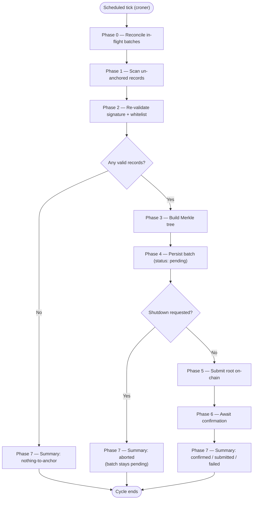

# `anchor-service` — Execution Cycle

`anchor-service` ([`apps/anchor-service`](../../apps/anchor-service)) is the long-lived daemon responsible for Flow 1 of the architecture (see [`ARCHITECTURE.md`](ARCHITECTURE.md) §3): it periodically collects business records that have not yet been anchored, re-validates them, builds a Merkle tree, writes the resulting root to the [`MerkleAnchorRegistry`](../../apps/integrity-domain/contracts/MerkleAnchorRegistry.sol) smart contract, and persists the batch and every record's individual proof. It is the **only** component in the system that holds a funded wallet and writes to the blockchain — `monitor-service` only ever reads.

This document describes, step by step, everything the daemon does from process start to process exit: how it starts up, how it schedules its own work, what exactly happens inside a single execution cycle, and how it shuts down without losing or duplicating work.

---

## 1. Daemon Lifecycle

`anchor-service` is not a script that runs once — it is a long-running Node.js process (`apps/anchor-service/src/index.ts`) with three lifecycle stages: startup self-checks, a scheduled loop of execution cycles, and graceful shutdown.

### 1.1. Startup Self-Checks (Fail-Fast)

Before scheduling anything, the process validates its own environment and its ability to talk to both Postgres and the blockchain. Every check is fail-fast: if any of them fails, the process logs the error and exits immediately, rather than starting a scheduler that could never actually do useful work.

1. **Configuration parsing** (`src/config.ts`) — every required environment variable (`DATABASE_URL`, `RPC_URL`, `ANCHOR_CHAIN_ID`, `ANCHOR_PRIVATE_KEY`) must be present and well-formed; `ANCHOR_PRIVATE_KEY` must be a syntactically valid 32-byte hex string. `CONTRACT_ADDRESS` is optional — if absent, the target contract's address is resolved from `packages/contracts-shared`'s committed per-chain deployment registry, keyed by `ANCHOR_CHAIN_ID`.
2. **Empty whitelist warning** — if `WHITELIST_ADDRESSES` is empty, the process logs a prominent warning (not a fatal error) because this is a fail-closed condition: with no whitelisted address, every single record will fail Phase 2's validation and nothing will ever be anchored.
3. **Database connectivity** — a `SELECT 1` against the configured Postgres pool.
4. **Network identity** — the connected RPC endpoint's `chainId` (via `provider.getNetwork()`) must match the configured `ANCHOR_CHAIN_ID`, so the daemon can never accidentally submit to the wrong network.
5. **Contract deployment** — the resolved contract address must actually have bytecode on that network (`provider.getCode()` must not return `"0x"`).
6. **Wallet ownership** — the wallet derived from `ANCHOR_PRIVATE_KEY` must be the contract's `owner()`, since `addMerkleRoot` is `onlyOwner`. If it isn't, every submission would revert with `OwnableUnauthorizedAccount`, so this is caught here instead of on the first real cycle.

If any of steps 3-6 throws, the database pool and the chain provider are both closed before the process exits, so a failed startup never leaves dangling connections. If they all succeed, the pool and provider are deliberately **not** closed — they stay open for the scheduler's entire lifetime.

### 1.2. Scheduling

Once startup succeeds, `createCycleScheduler` wraps the whole execution cycle (§2 below) in a [`croner`](https://github.com/Hexagon/croner) job, configured with the cron expression in `ANCHOR_CRON_SCHEDULE` (default: `0 */3 * * *`, every 3 hours).

The scheduler's only real job beyond triggering the cycle on time is **overlap protection**: croner's own `protect: true` option guarantees that if one cycle is still running when the next scheduled tick arrives, that tick is simply skipped — at most one cycle ever runs at a time, in a single process. This is deliberately the *only* concurrency guard; there is no separate hand-rolled `isRunning` flag, since croner's own mechanism already covers it, and the same in-flight-cycle tracking is also what the shutdown sequence (§1.3) needs to know what to wait for.

(A second, independent instance of the daemon running concurrently — e.g. two containers pointed at the same database — is not prevented by `protect: true`, since that only guards a single process. That scenario is instead made safe by idempotency checks inside the cycle itself; see §3.)

### 1.3. Graceful Shutdown

On `SIGTERM` or `SIGINT`, the process does not exit immediately:

1. The croner job is stopped (`cron.stop()`) — no new cycle will ever start after this point.
2. A cooperative abort flag is flipped. The *currently running* cycle, if any, reads this flag at exactly one checkpoint (see Phase 4/5 below) and, if set, stops cleanly instead of starting a blockchain transaction.
3. If a cycle is in flight, the shutdown sequence waits for it to finish — but only up to `SHUTDOWN_GRACE_MS` (default: 600,000 ms / 10 minutes, which must comfortably exceed the longest realistic confirmation wait).
4. If the in-flight cycle finishes within the grace period, the database pool is closed and the chain provider is destroyed, and the process exits cleanly.
5. If the grace period elapses first (the cycle is genuinely stuck — for example, waiting on a transaction that will never confirm), the process hard-exits with a non-zero code instead of waiting indefinitely or risking a partial shutdown on a stuck cycle.

The cooperative abort checkpoint is placed at exactly one point in the whole cycle: right after Phase 4 (persist) and before Phase 5 (submit). Every earlier phase is redundant to interrupt, because croner's `stop()` already guarantees no *new* cycle starts; and every later phase (submit/confirm) is deliberately left to run to completion once started, so a transaction is never abandoned mid-flight — see Phase 6 for why an interrupted confirmation wait is still safe.

---

## 2. The Execution Cycle

Each scheduled tick runs exactly one execution cycle, implemented by `runCycle` (`src/cycle.ts`). A cycle is a strict sequence of eight phases, numbered 0-7 to match the design's own phase numbering (Phase 0 is a "before everything else" phase, not the first step of building a new batch).



The same eight phases, as a plain-text list:

```text
Phase 0  Reconcile in-flight batches (left over from a previous cycle/crash)
Phase 1  Scan for un-anchored records
Phase 2  Re-validate each record (signature + whitelist)
Phase 3  Build the Merkle tree
Phase 4  Persist the batch (durable, before anything touches the chain)
  ── cooperative shutdown checkpoint ──
Phase 5  Submit the root on-chain
Phase 6  Await confirmation
Phase 7  Assemble and log the cycle summary
```

If, after Phase 1-2, there are zero valid records to anchor, the cycle short-circuits straight to Phase 7 with a `nothing-to-anchor` summary — Phases 3-6 never run, and no empty batch is ever created.

### Phase 0 — Reconcile In-Flight Batches

**Responsibility:** resolve every batch left in a non-terminal state (`pending`, `submitted`, or `failed`) by a *previous* cycle — because the process crashed, was killed, or the blockchain was simply slow between cycles — before doing any new work. This phase never creates new batches; it only drives existing ones to a terminal state (`confirmed` or `failed`).

Implemented by `reconcileBatches` (`src/reconcile.ts`). For every in-flight batch, in order:

1. **Already-on-chain fast path.** Regardless of the batch's recorded status, the phase first checks whether its `merkle_root` is already registered on-chain (a gas-free `containsMerkleRoot` read). If it is, the batch is immediately marked `confirmed` — this single check resolves the most common crash scenario (the transaction was actually mined before the process died, but the local database never heard about it) without needing to inspect the specific status at all.
2. **`pending` batches** (persisted, but no transaction was ever sent) are submitted for the first time here, exactly as Phase 5 would.
3. **`submitted` batches** (a transaction was sent, but the process died before it confirmed) have their transaction hash inspected via a non-blocking receipt poll:
   - **confirmed** → mark `confirmed`.
   - **reverted** → mark `failed`.
   - **pending-confirmations** (mined, but not yet past the required confirmation count) → left alone, re-checked next cycle.
   - **missing** (the transaction was dropped or never propagated) → resent as a replacement, reusing the original nonce with a bumped fee.
4. **`failed` batches** are not simply retried blindly. First, the record set pinned to the batch (`anchor_records`) is re-streamed from the database and the Merkle root is *recomputed* from scratch. Only if the recomputed root still matches the originally stored root is the batch resubmitted — if it diverges, that is treated as a sign of possible tampering with the pinned batch data itself, logged loudly, and **not** auto-resolved; it needs a human. If a `failed` batch's retry count crosses `ANCHOR_RETRY_ALERT_THRESHOLD` (default: 5), a loud log line is emitted regardless of outcome, since a batch failing repeatedly usually means something structural is wrong (the wallet lost ownership, ran out of gas funds, or a configuration value is stuck).

This design means the system has **no automatic batch abandonment**: a batch keeps being retried every cycle, indefinitely, until it either succeeds or is manually intervened on.

### Phase 1 — Scan Un-Anchored Records

**Responsibility:** find every record that has not yet been anchored.

Implemented by `streamUnanchoredRecords` (`src/records-source.ts`): a single SQL query selects every row in `records` with no matching row in `anchor_records` (`NOT EXISTS`), ordered by `id`. The query is executed as a **stream** (`pg-query-stream`), fetching rows in batches of 10,000 by default, so the daemon's memory usage is bounded by the size of one fetch batch rather than by the total number of un-anchored records — this matters because the scan is expected to run against potentially very large backlogs.

### Phase 2 — Re-validate Each Record

**Responsibility:** re-check, independently of whatever `data-domain` already checked at write time, that each record is still legitimately signed and still permitted to be anchored.

Implemented by `validateRecord` (`src/validation.ts`), applied to every record streamed by Phase 1. Two checks, both of which must pass:

1. **Signature validity** — the ECDSA signature is verified against the record's canonicalized `payload` and must recover to exactly the address stored in `client_address`.
2. **Whitelist membership** — that same recovered/stored address must currently be present in `WHITELIST_ADDRESSES`.

These are two genuinely independent checks: a record can have a perfectly valid signature (the signer really is who `client_address` claims) while still failing validation, because the whitelist is re-checked at anchor time, not just at ingestion time — an address that was authorized when the record was written may have since been removed from the whitelist. A record only proceeds to Phase 3 if **both** checks pass.

Any record that fails either check is:
- excluded from the batch entirely (it is *not* anchored this cycle, and remains "un-anchored" — it will be re-scanned by Phase 1 on the very next cycle, since it has no `anchor_records` row);
- recorded as a `signature_mismatch` alert in `integrity_alerts`, deduplicated by `record_id` — a permanently-bad record is re-scanned and re-rejected every cycle, but only ever generates **one** alert, not one per cycle.

### Phase 3 — Build the Merkle Tree

**Responsibility:** turn the set of records that passed Phase 2 into one Merkle root and one inclusion proof per record.

Implemented by `buildAnchorTree` (`src/tree.ts`), a thin wrapper over `packages/crypto-utils`'s `buildMerkleTree` — the single source of truth for this logic across the whole system, kept byte-for-byte compatible with the `MerkleAnchorRegistry.sol` contract's own OpenZeppelin-based proof verification (see [`ARCHITECTURE.md`](ARCHITECTURE.md) §5). If Phase 2 rejected every record and none are left, Phase 3 never runs at all — the cycle short-circuits to a `nothing-to-anchor` summary (Phase 7) instead of ever calling the tree builder with an empty input.

### Phase 4 — Persist the Batch

**Responsibility:** make the batch's membership durable in Postgres *before* anything is sent to the blockchain.

Implemented by `persistBatch` (`src/batch-repository.ts`), as a single database transaction:

1. Insert one row into `batches`, with `status = 'pending'`, the computed `merkle_root`, and the record count.
2. Bulk-insert one row per record into `anchor_records` (`record_id`, `batch_id`, `merkle_proof`) via Postgres's `COPY … FROM STDIN` protocol for speed at scale, rather than one `INSERT` per record.

Both steps happen inside the same transaction, so a batch's membership is atomic: either every one of its records is durably pinned to it, or none are. This ordering — persist first, submit second — is deliberate: once this phase completes, the batch exists durably in the database with a `pending` status, so even if the process crashes immediately afterward, Phase 0 of the *next* cycle will find it and submit it. No batch's membership is ever decided by, or dependent on, anything that happens on-chain.

This is also the cooperative shutdown checkpoint described in §1.3: immediately after this phase, and before Phase 5, `runCycle` checks the shutdown-requested flag. If it is set, the cycle stops here — the batch is left `pending` in the database (safe, since Phase 0 will pick it up on the next process start) and Phases 5-6 never run, so a shutdown never interrupts an in-flight blockchain transaction.

### Phase 5 — Submit the Root On-Chain

**Responsibility:** get the batch's Merkle root registered on the smart contract, exactly once, handling transient failures without either losing the batch or double-spending gas.

Implemented by `submitAndConfirmBatch` (`src/cycle.ts`), calling into `submitRoot` (`src/chain-submit.ts`):

1. **Idempotency pre-check.** Before ever sending a transaction, the phase checks whether this exact root is already registered on-chain (the same gas-free `containsMerkleRoot` read Phase 0 uses). This is a narrow but real safety net: it guards against the case where this same batch was *already* submitted by a concurrent Phase 0 reconciliation (from this same cycle or another instance's) racing this exact Phase 5 — not against duplicate batch creation, which Postgres's own `UNIQUE(record_id)` constraint on `anchor_records` already prevents at the source. If the root is already found, the batch is marked `confirmed` immediately and no transaction is sent at all.
2. **Sending the transaction.** If the root genuinely isn't on-chain yet, `addMerkleRoot(root, batchSize)` is invoked. Sending uses [`p-retry`](https://github.com/sindresorhus/p-retry) with up to `ANCHOR_TX_RETRIES` attempts (default: 4). The very first attempt uses whatever fee the network currently reports; every retry after that — regardless of what caused the previous attempt to fail — carries an escalating fee bump (×1.25 per attempt), capped at `ANCHOR_MAX_FEE_GWEI` (default: 100 gwei), so a series of underpriced attempts converges instead of retrying forever at the same losing price.
3. **Revert classification.** Reverts are not all treated the same, because retrying a deterministic revert would just fail identically every time:
   - `RootAlreadyExists` — treated as **success** (another instance or a Phase 0 reconciliation beat this cycle to it); the batch is marked `confirmed` from a fresh on-chain lookup.
   - `OwnableUnauthorizedAccount` — the wallet is no longer the contract's owner. This aborts immediately, without retrying, and is treated as a structural, "poison batch" failure — no amount of retrying fixes a wrong wallet.
   - Any other named revert — also aborted immediately as a non-retryable failure, since a deterministic contract-level rejection will not change on a retry.
   - Anything else (network blips, RPC timeouts, rate limiting) — genuinely transient, and retried per the fee-bump schedule above.

### Phase 6 — Await Confirmation

**Responsibility:** wait, within the same cycle, for the submitted transaction to reach the required confirmation depth, and record its final, terminal outcome.

Implemented by `awaitConfirmation` (`src/chain-confirm.ts`), blocking until either `ANCHOR_CONFIRMATIONS` (default: 3; 2 is the typical setting for Polygon Amoy) confirmations are reached, or `ANCHOR_CONFIRMATION_TIMEOUT_MS` (default: 300,000 ms / 5 minutes) elapses. Three distinct outcomes:

1. **Confirmed successfully** — the batch is marked `confirmed`, with the block number and timestamp it was included in.
2. **Mined but reverted** — the one case this wait can conclusively resolve as bad news: the batch is marked `failed`.
3. **Timeout, or any other error while waiting** (network drop, RPC unavailability) — the batch is **not** marked `failed`. It is deliberately left in `submitted` state, because at this point its true on-chain fate is genuinely unknown — the transaction could still confirm later. This unresolved state is exactly what Phase 0 of the *next* cycle exists to clean up: it will poll the same transaction hash again and resolve it to whatever it actually became.

This is why Phase 6 never needs its own retry loop: an inconclusive wait simply defers resolution to the next cycle's Phase 0, rather than the current cycle blocking indefinitely or guessing at an outcome it cannot yet know.

### Phase 7 — Cycle Summary

**Responsibility:** assemble one structured record of everything this cycle did, for logging and future analysis.

Implemented by `buildCycleSummary` (`src/metrics.ts`). Every cycle — whether it anchored a batch, found nothing to anchor, was aborted for shutdown, or failed — ends by emitting exactly one structured summary, containing:

- the cycle number and its final `status` (`confirmed` | `submitted` | `failed` | `nothing-to-anchor` | `aborted`);
- Phase 0's reconciliation counts (`confirmed`/`resent`/`failed` batches resolved that cycle);
- how many records were scanned and how many were rejected in Phase 2;
- how many records ended up in the batch, its root, its transaction hash, and its block number (whichever of these apply to that cycle's outcome — most are `null` for a `nothing-to-anchor` cycle);
- a millisecond timing breakdown per phase (so a slow cycle can be diagnosed by which specific phase took the time), and the cycle's total duration;
- a peak memory (RSS) snapshot, to catch memory growth from very large scans before it becomes an operational problem.

This summary is the daemon's only structured, machine-parseable output about its own behavior — it is what an operator (or the benchmark harness under `apps/anchor-service/bench/`) would read to understand what a given cycle actually did.

---

## 3. Idempotency and Concurrency Safety (Recap)

Several of the phases above independently guard against the same underlying risk — that the same batch could be submitted to the chain more than once, or that two overlapping executions (across cycles, across a crash-and-restart, or across two instances of the daemon) could race each other:

- **Within one process:** croner's `protect: true` (§1.2) guarantees at most one cycle runs at a time.
- **Across a crash and restart, or a slow chain between cycles:** Phase 0 (§ above) reconciles whatever the previous cycle left in a non-terminal state before any new work happens.
- **Across concurrent submissions of the exact same root** (whether from this cycle's own Phase 0 racing its own Phase 5, or, in principle, a second daemon instance pointed at the same database and chain): Phase 5's idempotency pre-check, and `RootAlreadyExists` being treated as success rather than an error, both mean a duplicate submission attempt resolves to the correct `confirmed` state instead of failing or double-spending gas.
- **Duplicate batch *membership*** (the same record ending up pinned to two different batches) is prevented one layer below all of this, by Postgres's own `UNIQUE(record_id)` constraint on `anchor_records` — the real first line of defense, not application logic.

---

## 4. Batch Lifecycle (State Machine)

Every batch created by Phase 4 moves through a small state machine, entirely driven by the phases described above:

```text
pending ──(Phase 5 sends the transaction)──> submitted
submitted ──(Phase 6 or Phase 0 confirms it)──> confirmed
submitted ──(Phase 6 or Phase 0 sees a revert)──> failed
failed ──(Phase 0 recomputes the same root and resubmits)──> submitted
```

`confirmed` and `failed` are the only states a batch can leave *this* state machine in during normal operation — but `failed` is not truly terminal: as described in Phase 0, a `failed` batch keeps being retried by every subsequent cycle, forever, unless a human intervenes. There is no automatic abandonment of a batch anywhere in this system.
