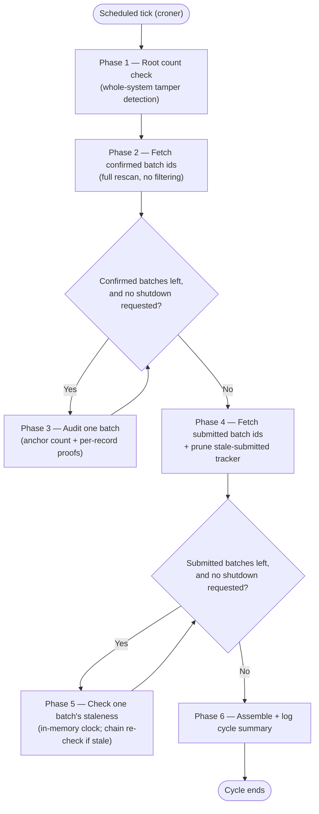

# `monitor-service` — Execution Cycle

`monitor-service` ([`apps/monitor-service`](../../apps/monitor-service)) is the long-lived daemon responsible for Flow 2 of the architecture (see [`ARCHITECTURE.md`](ARCHITECTURE.md) §3): it periodically re-derives every already-anchored batch's state directly from the raw `records`/`anchor_records` tables and the blockchain itself, and raises an alert the moment either one disagrees with what was actually anchored. It never signs or sends a blockchain transaction, and it never writes to Postgres beyond the alerts it emits — every other action this daemon takes is a read. `anchor-service` is the only component that holds a funded wallet and writes to the chain; `monitor-service` exists specifically so that guarantee doesn't have to be trusted blindly.

This document is more granular than `ARCHITECTURE.md`'s §6.2 summary and reflects the daemon's current implementation precisely — read this one when the question is specifically about how `monitor-service` behaves, phase by phase.

---

## 1. Daemon Lifecycle

`monitor-service` is not a script that runs once — it is a long-running Node.js process (`apps/monitor-service/src/index.ts`) with the same three lifecycle stages `anchor-service` has: startup self-checks, a scheduled loop of execution cycles, and graceful shutdown.

### 1.1. Startup Self-Checks (Fail-Fast)

Before scheduling anything, the process validates its own environment and its ability to talk to both Postgres and the blockchain. Every check is fail-fast: if any of them fails, the process logs the error and exits immediately.

1. **Configuration parsing** (`src/config.ts`) — every required environment variable (`DATABASE_URL`, `RPC_URL`, `ANCHOR_CHAIN_ID`) must be present and well-formed. `CONTRACT_ADDRESS` is optional and resolved the same way `anchor-service` resolves it, from `packages/contracts-shared`'s committed per-chain deployment registry.
2. **Private-key rejection.** If `ANCHOR_PRIVATE_KEY` is present in the environment at all, `loadConfig` throws immediately — the exact opposite of `anchor-service`'s own startup check. A signing key on a read-only auditor would be a real safety defect, not a harmless unused variable, so this is caught loudly before anything else runs.
3. **Database connectivity** — a `SELECT 1` against the configured Postgres pool.
4. **Network identity** — the connected RPC endpoint's `chainId` must match the configured `ANCHOR_CHAIN_ID`.
5. **Contract deployment** — the resolved contract address must actually have bytecode on that network.

There is no wallet-ownership check, because there is no wallet at all: `createReadOnlyChainClient` (`src/chain.ts`) never constructs an ethers `Wallet` — the `JsonRpcProvider` itself is the contract's `ContractRunner`, so every call this daemon ever makes is a `view` function.

If any of steps 3-5 throws, the database pool and the chain provider are both closed before the process exits. If they all succeed, the pool and provider stay open for the scheduler's entire lifetime.

### 1.2. Chain Client and Retry Policy

Every on-chain read this daemon makes — `getBatchInfo` (Phases 3 and 5) and `getRootCount` (Phase 1) — goes through the same retry wrapper, `createRetryingContract` (`src/chain.ts`), built once at startup around the read-only contract instance and reused for the process's entire lifetime.

A genuine contract revert is deterministic: retrying `RootDoesNotExist` a second time would fail identically, so any error `decodeRevertName` (`packages/contracts-shared`) can decode into a named revert aborts immediately, without retrying. Everything else — timeouts, connection resets, rate limiting — is a transient network condition and is retried via [`p-retry`](https://github.com/sindresorhus/p-retry), up to `MONITOR_RPC_RETRIES` attempts (default: 4). Unlike `anchor-service`'s equivalent retry policy, there is no fee-bumping schedule here at all — these are free reads, not paid transactions, so there is nothing to bump.

### 1.3. Scheduling

Once startup succeeds, `createCycleScheduler` (`src/index.ts`) wraps the whole execution cycle (§2 below) in a [`croner`](https://github.com/Hexagon/croner) job, configured with the cron expression in `MONITOR_CRON_SCHEDULE` (default: `*/5 * * * *`, every 5 minutes — deliberately much tighter than `anchor-service`'s 3-hour default, since every cycle here is cheap reads plus, usually, zero writes, and running often directly shrinks how long a genuine divergence can go unnoticed).

Overlap protection uses croner's `protect` option, but not as a bare `protect: true`: it's given `logSkippedOverlap(logger)` (`src/index.ts`), so a skipped tick is explicitly logged as a warning naming the still-running cycle's start time (`job.currentRun()`), rather than silently dropped. This callback can only be exercised by a genuinely overlapping *scheduled* tick — a manually triggered cycle (`.cron.trigger()`, what every other test in this codebase uses to drive a cycle without waiting on a real cron pattern) never goes through `protect` at all, verified directly against croner's own behavior. At most one cycle ever runs at a time, in a single process.

### 1.4. Graceful Shutdown

On `SIGTERM` or `SIGINT`, `shutdownGracefully` (`packages/service-runtime` — the exact same function `anchor-service` uses) runs:

1. The croner job is stopped — no new cycle will ever start after this point.
2. A cooperative abort flag is flipped.
3. If a cycle is in flight, the shutdown sequence waits for it to finish — but only up to `SHUTDOWN_GRACE_MS` (default: 30,000 ms / 30 seconds). This is deliberately much shorter than `anchor-service`'s 10-minute default: there is no pending blockchain transaction to protect here, only a handful of reads in flight at any one moment.
4. If the in-flight cycle finishes within the grace period, the database pool is closed and the chain provider is destroyed, and the process exits cleanly.
5. If the grace period elapses first, the process hard-exits with a non-zero code.

Unlike `anchor-service`'s single fixed abort checkpoint (between persisting a batch and submitting it), `runMonitorCycle` checks the abort flag *before every batch iteration*, in both of its per-batch loops (Phase 3's confirmed-batch audit loop and Phase 5's stale-submitted-batch loop) — see §2. An in-flight check for the current batch always finishes; only the *next* batch in either loop is skipped. This is safe everywhere in this daemon, because every unit of work it performs is a read plus at most one alert insert — nothing is ever left half-sent the way an in-flight blockchain transaction would be.

---

## 2. The Execution Cycle

Each scheduled tick runs exactly one execution cycle, implemented by `runMonitorCycle` (`src/cycle.ts`). Unlike `anchor-service`'s single linear sequence of phases, this cycle runs three largely independent checks back to back — a whole-system count check, a full per-batch rescan, and a per-batch staleness check — aggregating all three into one structured summary at the end.



The same six phases, as a plain-text list:

```text
Phase 1  Root count check (contract total vs. tracked batches in Postgres)
Phase 2  Fetch every confirmed batch id (full rescan, no filtering)
Phase 3  Audit one confirmed batch (loops over Phase 2's ids)
Phase 4  Fetch every submitted batch id + prune the stale-submitted tracker
Phase 5  Check one submitted batch's staleness (loops over Phase 4's ids)
Phase 6  Assemble and log the cycle summary
```

Phases 1-2 and 4-5 never depend on each other's outcome, and none of the four checks (Phase 1's count check, Phase 3's two checks, Phase 5's staleness check) ever stops the cycle from running the rest — a single batch's failure, or even the whole-system count check failing, only ever fires an alert and continues.

### Phase 1 — Root Count Check

**Responsibility:** detect whether an entire batch has been hidden from Phase 2's rescan — a gap the rescan alone cannot see, since it can only ever audit batches whose `status` still says `'confirmed'` in Postgres.

Implemented inline in `runMonitorCycle`, via `checkRootCount` (`src/root-count-check.ts`):

1. Two reads, in parallel: the contract's `getRootCount()` — the total number of roots it has ever accepted, one per successful `addMerkleRoot` call, ever, across every batch — against `countTrackedBatches` (`src/batch-selection-repository.ts`), a `COUNT(*)` of every `batches` row currently `'confirmed'` or `'submitted'`.
2. If the two disagree, there is no way to know from this check alone which specific batch is missing — hiding a batch's status away from both `'confirmed'` and `'submitted'` removes it from every other check this daemon runs. This fires a `root_divergence` alert with a `null` `batch_id` — the one alert this daemon writes with no batch to blame.
3. Regardless of the outcome, the cycle always continues to Phase 2 — this check never blocks or short-circuits anything.

`'submitted'` batches are included in the tracked count, not only `'confirmed'` ones, for a specific reason: if they weren't, hiding a real batch could be compensated with a cheap, fake `'submitted'` row — invisible to Phase 2's rescan and, on its own, enough to make this check pass. Phase 5 exists specifically to close that remaining gap.

### Phase 2 — Fetch Confirmed Batch IDs (Full Rescan)

**Responsibility:** decide which batches Phase 3 audits, without letting anything stored in Postgres gate that decision.

Implemented by `findConfirmedBatchIds` (`src/batch-selection-repository.ts`): `SELECT id FROM batches WHERE status = 'confirmed' ORDER BY created_at ASC`. Deliberately unfiltered and unlimited — no `LIMIT`, no cursor, no "last verified at" column, no stored progress of any kind. Every confirmed batch is audited every single cycle.

This is a considered choice, not the obvious default. An earlier version of this policy considered a per-batch `last_verified_at` timestamp, auditing the least-recently-checked batches first — rejected because that timestamp would live in the exact database this whole system assumes a privileged attacker can freely write to. An attacker who tampers with a batch could simply also bump its own `last_verified_at` to "now," pushing it to the back of the queue indefinitely. Full rescan has no such state to attack. See `docs/overview/monitor-service/new_specs/2026-09-24-batch-selection-strategies.md` for the full comparison against that rejected alternative, and a documented (not built) random-sampling strategy for if this system's scale ever outgrows a full rescan's cost.

### Phase 3 — Audit One Batch

**Responsibility:** for one already-confirmed batch, verify both that every one of its records is still present, and that none of their content has been edited since anchoring.

Implemented by `auditBatch` (`src/audit.ts`), called once per batch id from Phase 2:

1. **Ground truth from the chain.** `getBatchInfo(batchId)` — never Postgres's own `batches.size`/`merkle_root` — is the only source this phase trusts for what this batch actually anchored. If this reverts `RootDoesNotExist` (a `'confirmed'` Postgres row with no matching on-chain `BatchInfo` at all), the revert propagates out of `auditBatch` uncaught; `runMonitorCycle` catches it at the loop level, fires a `root_divergence` alert (`expected_root: null`, since there is no root to report) naming that batch id, and moves on. Any other exception (a genuinely unexpected shape, a dropped connection mid-stream) is logged and the batch is skipped without an alert — it's an anomaly, not evidence of tampering, and the full rescan will pick this same batch up again next cycle regardless.
2. **Anchor count check.** `countAnchoredRecords` (`src/audit-repository.ts`) — a plain `COUNT(*)` of this batch's current `anchor_records` rows — is compared against the on-chain `size` via `checkAnchorCount` (`src/anchor-count.ts`). Any mismatch, not only "fewer than," fires a `root_divergence` alert. This is the one gap a per-record proof loop can never notice on its own, since it only ever visits rows that are still there — a deleted `anchor_records` row is invisible to it.
3. **Per-record proof verification.** `streamAnchoredRecords` (`src/audit-repository.ts`) streams every `anchor_records` row still pinned to this batch, joined against that record's *current* raw `records` columns. `verifyAnchoredRecord` (`src/record-verification.ts`) recomputes each leaf from those current columns — via the same `computeLeafHash` the contract itself is compatible with, never a precomputed hash — and checks it against the proof captured at anchor time plus the batch's on-chain root. Any record whose leaf no longer verifies fires a `record_tampered` alert naming that specific `record_id`. `verifyAnchoredRecord` never throws, even on a malformed `client_address`/`signature` that would otherwise make `computeLeafHash` itself throw — a row a privileged actor edited directly is reported as a normal tamper finding, not a crash that would abort the whole batch's audit.

Steps 2 and 3 both run for every batch, every cycle, independently of each other's outcome — a deleted row and an edited row can coexist in the same batch, and neither check is skipped because of the other.

### Phase 4 — Fetch Submitted Batch IDs, Prune the Stale-Submitted Tracker

**Responsibility:** decide which `'submitted'` batches Phase 5 individually re-checks this cycle, and stop tracking any batch that's no longer in that state.

Implemented by `findSubmittedBatchIds` (`src/batch-selection-repository.ts`) — the same unfiltered, full-rescan shape as Phase 2, against `status = 'submitted'` instead — followed immediately by `pruneSubmittedTracking` (backed by `createStaleSubmittedTracker`'s `pruneExcept`, `src/stale-submitted-tracker.ts`), which drops tracking for any batch id this process previously watched that isn't in this cycle's submitted list anymore.

### Phase 5 — Check One Submitted Batch's Staleness

**Responsibility:** eventually catch a fake `'submitted'` row — the one padding vector Phase 1's count check cannot, on its own, tell apart from a real batch still legitimately confirming — without alarming on every genuinely in-flight batch that simply hasn't been mined yet.

Implemented inline in `runMonitorCycle`, backed by `createStaleSubmittedTracker` (`src/stale-submitted-tracker.ts`):

1. `observeSubmittedBatch(batchId)` records the first time this *process* has ever seen this batch id as `'submitted'` (`Date.now()` — this process's own clock, never anything read from Postgres) and returns whether it has been continuously tracked, unresolved, for at least `MONITOR_SUBMITTED_STALE_MS` (default: 24 hours). If not yet stale, nothing else happens for this batch this cycle — the ordinary state for almost every submitted batch, which usually confirms within minutes.
2. Once a batch id *is* stale, `getBatchInfo(batchId)` is called for real. If it now succeeds, the batch landed on-chain and Postgres's `status` column simply hasn't caught up yet — that's `anchor-service`'s own reconcile loop's job, not this daemon's — and nothing further happens. If it reverts `RootDoesNotExist`, that is the signal: a batch that has claimed to be on its way to being anchored for far longer than any honest confirmation or resend cycle should ever take, and that still does not exist on-chain at all. This fires a `root_divergence` alert (`expected_root: null`) naming that batch id.

**Why 24 hours, and why it cannot be shorter:** `anchor-service`'s own reconcile pass runs only once per `ANCHOR_CRON_SCHEDULE` tick (default every 3 hours), and a resend does not wait for its own confirmation either — it fires and returns, so confirming a resent transaction needs another full cron interval on top. Under nothing but `anchor-service`'s own defaults, a perfectly healthy submitted batch can legitimately take 6+ hours to resolve. An earlier version of this threshold (30 minutes, sized only against a single confirmation wait) would have false-alarmed on that entirely normal delay constantly. See [`docs/superpowers/specs/2026-09-24-monitor-service-daemon-design.md`](../superpowers/specs/2026-09-24-monitor-service-daemon-design.md) §3.1 for the full reasoning.

**Why this has to be this process's own clock, not `batches.created_at`:** that column is an ordinary, attacker-writable value under this system's own threat model — an attacker could keep a fake row's `created_at` pinned to "now" every cycle, forever suppressing this exact check. Tracking "how long have I personally watched this batch" in memory, never persisted anywhere, closes that hole specifically. The one honest tradeoff: a `monitor-service` restart resets the tracker, giving every currently-submitted batch one fresh grace period. That is a bounded, one-time delay, not a standing gap — exploiting it would need the ability to restart `monitor-service` itself faster than the threshold, repeatedly, which needs process control on the monitoring host, outside this system's threat model (database write access only).

### Phase 6 — Cycle Summary

**Responsibility:** assemble one structured record of everything the cycle did.

Implemented inline at the end of `runMonitorCycle`, logged via `logger.info(summary, "monitor cycle complete")`. Every cycle emits exactly one `MonitorCycleSummary`, containing:

- the cycle number, a per-stage timing breakdown (`stageMs`: `rootCountCheck`, `findConfirmedBatchIds`, `confirmedAudit`, `findSubmittedBatchIds`, `submittedStaleCheck`) and total `durationMs`, so a slow cycle can be diagnosed by which specific stage took the time;
- `rootCountMatches` — whether Phase 1 found the two counts equal;
- `batchesChecked` / `batchesComplete` and `recordsChecked` / `tamperedCount` from Phase 3;
- `submittedBatchesStaleChecked` — how many submitted batches actually crossed the staleness threshold and were individually re-checked this cycle, not how many are merely `'submitted'` — most cycles this is zero;
- `alertsFired` — the total number of alerts written this cycle, across all three checks combined;
- `peakRssBytes` — a peak memory snapshot taken once per audited batch, to catch memory growth from a very large rescan before it becomes an operational problem.

---

## 3. Detection Guarantees (Recap)

The four checks above (Phase 1's count check; Phase 3's anchor-count check and per-record proof loop; Phase 5's staleness check) each close a gap the others cannot see on their own — none is redundant with any other:

- **Phase 3's per-record proof loop** catches an *edited* row — a record still present, still pinned to its batch, whose content no longer matches what was anchored.
- **Phase 3's anchor count check** catches a *deleted* row — a record whose `anchor_records` pin vanished entirely, invisible to a proof loop that can only ever visit rows still there.
- **Phase 1's root count check** catches a *hidden batch* — an entire batch flipped away from both `'confirmed'` and `'submitted'`, invisible to Phase 2's rescan, which can only ever audit batches whose status still says `'confirmed'`.
- **Phase 5's stale-submitted check** catches a *forged padding batch* — a fake `'submitted'` row inserted specifically to keep Phase 1's count balanced after hiding a real one, which Phase 1 alone cannot distinguish from a real batch still legitimately confirming.

Together, there is no way to tamper with a `records` row, delete an `anchor_records` pin, or hide/fake a `batches` row that survives more than one cycle (Phases 1-3) or `MONITOR_SUBMITTED_STALE_MS` (Phase 5) undetected. See [`docs/superpowers/specs/2026-09-24-monitor-service-daemon-design.md`](../superpowers/specs/2026-09-24-monitor-service-daemon-design.md) §3.1 for the argument for why this is complete without needing to enumerate every root the contract has ever accepted.

Every alert this daemon writes is deduplicated before insertion. `recordRootDivergence` / `recordTampered` (`src/alerts.ts`) each check for an existing row of the same `alert_type`, keyed by `batch_id` (using Postgres's null-safe `IS NOT DISTINCT FROM`, since the whole-system count check's alert has a `null` `batch_id`) or `record_id`, before writing a new one. A batch or record that keeps failing the same check, cycle after cycle, produces exactly one alert, not one per cycle — the same convention `anchor-service`'s own `signature_mismatch` alerts already use.

---

## 4. Alert Taxonomy

| `alert_type` | Fired by | `batch_id` | `record_id` | `expected_root` | Meaning |
|---|---|---|---|---|---|
| `root_divergence` | Phase 1 | `null` | `null` | `null` | The contract's total root count disagrees with how many batches Postgres tracks as on-chain-or-on-the-way. No single batch to blame. |
| `root_divergence` | Phase 3 (step 1) | real | `null` | `null` | A `'confirmed'` batch has no on-chain `BatchInfo` at all — its status was tampered, or it was never really confirmed. |
| `root_divergence` | Phase 3 (step 2) | real | `null` | on-chain root | A batch's `anchor_records` count no longer matches its on-chain size — a pinned record was deleted (or, anomalously, an extra one appeared). |
| `root_divergence` | Phase 5 | real | `null` | `null` | A `'submitted'` batch has had no on-chain `BatchInfo` for longer than any honest confirmation/resend cycle should take — likely fabricated or permanently stuck. |
| `record_tampered` | Phase 3 (step 3) | real | real | on-chain root | One specific record's recomputed leaf no longer verifies against its stored proof and the batch's on-chain root — its data was edited after anchoring. |

Every row here is written with `source = 'monitor'`, distinguishing it from `anchor-service`'s own `signature_mismatch` alerts (`source = 'anchor'`) in the same `integrity_alerts` table.
