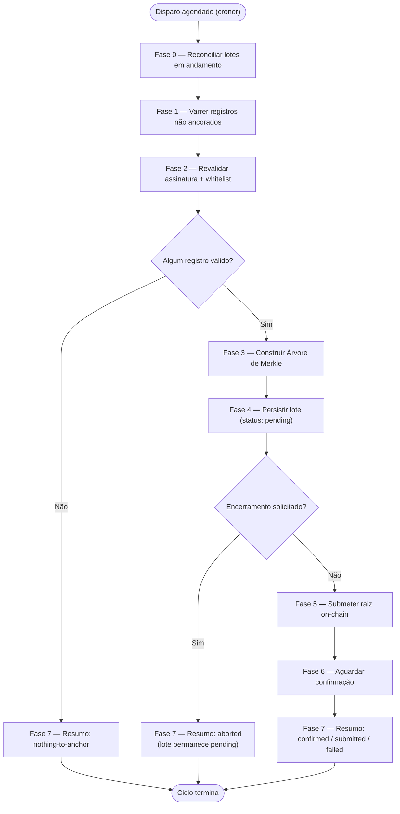

# `anchor-service` — Ciclo de Execução

O `anchor-service` ([`apps/anchor-service`](../../apps/anchor-service)) é o daemon de longa duração responsável pelo Fluxo 1 da arquitetura (ver [`ARCHITECTURE.md`](ARCHITECTURE.md) §3): periodicamente, ele coleta registros de negócio ainda não ancorados, os revalida, constrói uma Árvore de Merkle, escreve a raiz resultante no contrato inteligente [`MerkleAnchorRegistry`](../../apps/integrity-domain/contracts/MerkleAnchorRegistry.sol) e persiste o lote junto com a prova individual de cada registro. É o **único** componente do sistema que possui uma carteira financiada e escreve na blockchain — o `monitor-service` apenas lê.

Este documento descreve, passo a passo, tudo o que o daemon faz desde a inicialização do processo até seu encerramento: como ele sobe, como agenda seu próprio trabalho, o que exatamente acontece dentro de um único ciclo de execução, e como ele encerra sem perder nem duplicar trabalho.

---

## 1. Ciclo de Vida do Daemon

O `anchor-service` não é um script executado uma única vez — é um processo Node.js de longa duração (`apps/anchor-service/src/index.ts`) com três estágios de ciclo de vida: verificações iniciais de sanidade (_self-checks_), um laço agendado de ciclos de execução, e um encerramento gracioso (_graceful shutdown_).

### 1.1. Verificações Iniciais de Sanidade (_Fail-Fast_)

Antes de agendar qualquer coisa, o processo valida seu próprio ambiente e sua capacidade de se comunicar tanto com o Postgres quanto com a blockchain. Toda verificação é _fail-fast_: se qualquer uma delas falhar, o processo registra o erro e encerra imediatamente, em vez de subir um agendador que nunca conseguiria de fato realizar trabalho útil.

1. **Parsing da configuração** (`src/config.ts`) — toda variável de ambiente obrigatória (`DATABASE_URL`, `RPC_URL`, `ANCHOR_CHAIN_ID`, `ANCHOR_PRIVATE_KEY`) deve estar presente e bem formada; `ANCHOR_PRIVATE_KEY` precisa ser uma string hexadecimal de 32 bytes sintaticamente válida. `CONTRACT_ADDRESS` é opcional — se ausente, o endereço do contrato-alvo é resolvido a partir do registro de deployments por rede já commitado em `packages/contracts-shared`, indexado por `ANCHOR_CHAIN_ID`.
2. **Aviso de whitelist vazia** — se `WHITELIST_ADDRESSES` estiver vazia, o processo registra um aviso proeminente (não um erro fatal), pois essa é uma condição _fail-closed_: sem nenhum endereço na whitelist, todo e qualquer registro falhará na validação da Fase 2 e nada jamais será ancorado.
3. **Conectividade com o banco** — um `SELECT 1` contra o pool do Postgres configurado.
4. **Identidade da rede** — o `chainId` do endpoint RPC conectado (via `provider.getNetwork()`) precisa corresponder ao `ANCHOR_CHAIN_ID` configurado, de modo que o daemon nunca possa submeter acidentalmente para a rede errada.
5. **Deployment do contrato** — o endereço de contrato resolvido precisa de fato possuir bytecode naquela rede (`provider.getCode()` não pode retornar `"0x"`).
6. **Propriedade (_ownership_) da carteira** — a carteira derivada de `ANCHOR_PRIVATE_KEY` precisa ser o `owner()` do contrato, já que `addMerkleRoot` é `onlyOwner`. Caso não seja, toda submissão reverteria com `OwnableUnauthorizedAccount` — por isso essa verificação é feita aqui, em vez de ser descoberta apenas no primeiro ciclo real.

Se qualquer uma das etapas 3-6 lançar um erro, tanto o pool do banco quanto o provider da chain são fechados antes do processo encerrar, de modo que uma inicialização falha nunca deixa conexões penduradas. Se todas forem bem-sucedidas, o pool e o provider deliberadamente **não** são fechados — eles permanecem abertos durante todo o ciclo de vida do agendador.

### 1.2. Agendamento

Uma vez que a inicialização é bem-sucedida, `createCycleScheduler` envolve todo o ciclo de execução (§2 abaixo) em um job do [`croner`](https://github.com/Hexagon/croner), configurado com a expressão cron em `ANCHOR_CRON_SCHEDULE` (padrão: `0 */3 * * *`, a cada 3 horas).

A única responsabilidade real do agendador, além de disparar o ciclo no horário certo, é a **proteção contra sobreposição**: a própria opção `protect: true` do croner garante que, se um ciclo ainda estiver em execução quando o próximo disparo agendado chegar, esse disparo é simplesmente ignorado — no máximo um ciclo roda por vez, dentro de um único processo. Essa é deliberadamente a *única* guarda de concorrência; não existe uma flag `isRunning` construída à mão em paralelo, já que o mecanismo do próprio croner já cobre isso, e o mesmo rastreamento de "há um ciclo em andamento" é também o que a sequência de encerramento (§1.3) precisa saber para decidir o que esperar.

(Uma segunda instância independente do daemon rodando concorrentemente — por exemplo, dois containers apontando para o mesmo banco de dados — não é evitada por `protect: true`, já que esse mecanismo protege apenas um único processo. Esse cenário é, em vez disso, tornado seguro por verificações de idempotência dentro do próprio ciclo; ver §3.)

### 1.3. Encerramento Gracioso (_Graceful Shutdown_)

Ao receber `SIGTERM` ou `SIGINT`, o processo não encerra imediatamente:

1. O job do croner é parado (`cron.stop()`) — nenhum novo ciclo começará a partir deste ponto.
2. Uma flag cooperativa de aborto é ativada. O ciclo *atualmente em execução*, se houver, lê essa flag em exatamente um checkpoint (ver Fase 4/5 abaixo) e, se estiver ativada, para de forma limpa em vez de iniciar uma transação na blockchain.
3. Se houver um ciclo em andamento, a sequência de encerramento espera por ele terminar — mas apenas até `SHUTDOWN_GRACE_MS` (padrão: 600.000 ms / 10 minutos, que precisa exceder confortavelmente a mais longa espera de confirmação realista).
4. Se o ciclo em andamento termina dentro do período de tolerância, o pool do banco é fechado e o provider da chain é destruído, e o processo encerra de forma limpa.
5. Se o período de tolerância se esgota primeiro (o ciclo está genuinamente travado — por exemplo, esperando por uma transação que nunca confirmará), o processo encerra abruptamente (_hard-exit_) com um código de saída diferente de zero, em vez de esperar indefinidamente ou arriscar um encerramento parcial sobre um ciclo travado.

O checkpoint cooperativo de aborto é colocado em exatamente um ponto de todo o ciclo: logo após a Fase 4 (persistência) e antes da Fase 5 (submissão). Interromper qualquer fase anterior seria redundante, pois o `stop()` do croner já garante que nenhum *novo* ciclo comece; e qualquer fase posterior (submissão/confirmação) é deliberadamente deixada para rodar até o fim uma vez iniciada, de modo que uma transação nunca é abandonada no meio do caminho — ver Fase 6 para entender por que uma espera de confirmação interrompida ainda é segura.

---

## 2. O Ciclo de Execução

Cada disparo agendado executa exatamente um ciclo de execução, implementado por `runCycle` (`src/cycle.ts`). Um ciclo é uma sequência estrita de oito fases, numeradas de 0 a 7 para corresponder à própria numeração de fases do design (a Fase 0 é uma fase "antes de tudo o mais", não o primeiro passo de construção de um novo lote).



As mesmas oito fases, em formato de lista de texto simples:

```text
Fase 0  Reconciliar lotes em andamento (deixados por um ciclo/crash anterior)
Fase 1  Varrer registros ainda não ancorados
Fase 2  Revalidar cada registro (assinatura + whitelist)
Fase 3  Construir a Árvore de Merkle
Fase 4  Persistir o lote (de forma durável, antes de qualquer contato com a chain)
  ── checkpoint cooperativo de encerramento ──
Fase 5  Submeter a raiz on-chain
Fase 6  Aguardar confirmação
Fase 7  Montar e registrar o resumo do ciclo
```

Se, após as Fases 1-2, restarem zero registros válidos para ancorar, o ciclo salta diretamente para a Fase 7 com um resumo do tipo `nothing-to-anchor` — as Fases 3-6 nunca são executadas, e nenhum lote vazio é jamais criado.

### Fase 0 — Reconciliar Lotes em Andamento

**Responsabilidade:** resolver todo lote deixado em estado não-terminal (`pending`, `submitted` ou `failed`) por um ciclo *anterior* — porque o processo travou, foi encerrado à força, ou a blockchain simplesmente demorou entre ciclos — antes de realizar qualquer trabalho novo. Esta fase nunca cria novos lotes; ela apenas conduz lotes já existentes até um estado terminal (`confirmed` ou `failed`).

Implementada por `reconcileBatches` (`src/reconcile.ts`). Para cada lote em andamento, em ordem:

1. **Caminho rápido de "já está on-chain".** Independentemente do status registrado do lote, a fase primeiro verifica se sua `merkle_root` já está registrada on-chain (uma leitura `containsMerkleRoot` sem custo de gas). Se estiver, o lote é imediatamente marcado como `confirmed` — essa única verificação resolve o cenário de crash mais comum (a transação foi de fato minerada antes do processo morrer, mas o banco de dados local nunca soube disso) sem sequer precisar inspecionar o status específico.
2. **Lotes `pending`** (persistidos, mas cuja transação nunca foi enviada) são submetidos pela primeira vez aqui, exatamente como a Fase 5 faria.
3. **Lotes `submitted`** (uma transação foi enviada, mas o processo morreu antes dela confirmar) têm seu hash de transação inspecionado via uma consulta de recibo não-bloqueante:
   - **confirmed** → marca como `confirmed`.
   - **reverted** → marca como `failed`.
   - **pending-confirmations** (minerada, mas ainda não passou da contagem de confirmações exigida) → deixado como está, reverificado no próximo ciclo.
   - **missing** (a transação foi descartada ou nunca se propagou) → reenviada como substituição, reutilizando o nonce original com uma taxa (_fee_) aumentada.
4. **Lotes `failed`** não são simplesmente re-tentados às cegas. Primeiro, o conjunto de registros vinculado ao lote (`anchor_records`) é re-lido do banco de dados e a Raiz de Merkle é *recomputada* do zero. Somente se a raiz recomputada ainda corresponder à raiz originalmente armazenada é que o lote é resubmetido — se ela divergir, isso é tratado como um sinal de possível adulteração dos próprios dados do lote persistido, registrado de forma bem visível, e **não** resolvido automaticamente; requer intervenção humana. Se a contagem de tentativas de um lote `failed` ultrapassar `ANCHOR_RETRY_ALERT_THRESHOLD` (padrão: 5), uma linha de log de alto destaque é emitida independentemente do resultado, já que um lote falhando repetidamente geralmente indica que algo estrutural está errado (a carteira perdeu a propriedade do contrato, ficou sem fundos para gas, ou algum valor de configuração está travado).

Esse design implica que o sistema **não possui abandono automático de lotes**: um lote continua sendo re-tentado a cada ciclo, indefinidamente, até que ou tenha sucesso ou receba intervenção manual.

### Fase 1 — Varrer Registros Ainda Não Ancorados

**Responsabilidade:** encontrar todo registro que ainda não foi ancorado.

Implementada por `streamUnanchoredRecords` (`src/records-source.ts`): uma única consulta SQL seleciona toda linha em `records` que não possui uma linha correspondente em `anchor_records` (`NOT EXISTS`), ordenada por `id`. A consulta é executada como um **stream** (`pg-query-stream`), buscando linhas em lotes de 10.000 por padrão, de modo que o consumo de memória do daemon fica limitado pelo tamanho de um único lote de busca, e não pelo número total de registros não ancorados — isso importa porque a varredura pode precisar lidar com um volume acumulado potencialmente muito grande.

### Fase 2 — Revalidar Cada Registro

**Responsabilidade:** reverificar, de forma independente de qualquer verificação já feita pelo `data-domain` no momento da escrita, que cada registro ainda está legitimamente assinado e ainda tem permissão para ser ancorado.

Implementada por `validateRecord` (`src/validation.ts`), aplicada a cada registro entregue pela Fase 1. Duas verificações, ambas precisam passar:

1. **Validade da assinatura** — a assinatura ECDSA é verificada contra o `payload` canonicalizado do registro, e precisa recuperar exatamente o endereço armazenado em `client_address`.
2. **Pertencimento à whitelist** — esse mesmo endereço recuperado/armazenado precisa estar atualmente presente em `WHITELIST_ADDRESSES`.

Essas são duas verificações genuinamente independentes: um registro pode ter uma assinatura perfeitamente válida (quem assinou realmente é quem `client_address` afirma) e ainda assim falhar na validação, porque a whitelist é reverificada no momento da ancoragem, não apenas no momento da ingestão — um endereço que estava autorizado quando o registro foi escrito pode ter sido removido da whitelist desde então. Um registro só avança para a Fase 3 se **ambas** as verificações passarem.

Todo registro que falha em qualquer uma delas é:
- excluído do lote por completo (ele *não* é ancorado neste ciclo, e permanece "não ancorado" — será revarrido pela Fase 1 no próximo ciclo, já que não possui linha em `anchor_records`);
- registrado como um alerta `signature_mismatch` em `integrity_alerts`, deduplicado por `record_id` — um registro permanentemente ruim é revarrido e rerejeitado a cada ciclo, mas gera apenas **um** alerta, nunca um por ciclo.

### Fase 3 — Construir a Árvore de Merkle

**Responsabilidade:** transformar o conjunto de registros que passaram pela Fase 2 em uma única Raiz de Merkle e uma prova de inclusão por registro.

Implementada por `buildAnchorTree` (`src/tree.ts`), um wrapper fino sobre o `buildMerkleTree` de `packages/crypto-utils` — a fonte única da verdade para essa lógica em todo o sistema, mantida byte-a-byte compatível com a própria verificação de provas baseada em OpenZeppelin do contrato `MerkleAnchorRegistry.sol` (ver [`ARCHITECTURE.md`](ARCHITECTURE.md) §5). Se a Fase 2 rejeitou todos os registros e nenhum restou, a Fase 3 nunca chega a executar — o ciclo salta diretamente para um resumo `nothing-to-anchor` (Fase 7) em vez de chamar o construtor da árvore com uma entrada vazia.

### Fase 4 — Persistir o Lote

**Responsabilidade:** tornar a composição do lote durável no Postgres *antes* de qualquer coisa ser enviada à blockchain.

Implementada por `persistBatch` (`src/batch-repository.ts`), como uma única transação de banco de dados:

1. Insere uma linha em `batches`, com `status = 'pending'`, a `merkle_root` calculada, e a contagem de registros.
2. Insere em massa uma linha por registro em `anchor_records` (`record_id`, `batch_id`, `merkle_proof`) via o protocolo `COPY … FROM STDIN` do Postgres, por velocidade em escala, em vez de um `INSERT` por registro.

Ambas as etapas acontecem dentro da mesma transação, de modo que a composição de um lote é atômica: ou todos os seus registros ficam durativamente vinculados a ele, ou nenhum fica. Essa ordem — persistir primeiro, submeter depois — é deliberada: uma vez que essa fase é concluída, o lote existe de forma durável no banco de dados com status `pending`, então, mesmo que o processo trave logo em seguida, a Fase 0 do *próximo* ciclo o encontrará e o submeterá. A composição de nenhum lote é jamais decidida por, ou depende de, algo que acontece on-chain.

Este é também o checkpoint cooperativo de encerramento descrito em §1.3: imediatamente após esta fase, e antes da Fase 5, `runCycle` verifica a flag de encerramento solicitado. Se estiver ativada, o ciclo para aqui — o lote é deixado como `pending` no banco de dados (seguro, já que a Fase 0 o pegará na próxima inicialização do processo) e as Fases 5-6 nunca são executadas, de modo que um encerramento nunca interrompe uma transação em andamento na blockchain.

### Fase 5 — Submeter a Raiz On-Chain

**Responsabilidade:** fazer com que a Raiz de Merkle do lote seja registrada no contrato inteligente, exatamente uma vez, lidando com falhas transitórias sem nunca perder o lote nem gastar gas em duplicidade.

Implementada por `submitAndConfirmBatch` (`src/cycle.ts`), que chama `submitRoot` (`src/chain-submit.ts`):

1. **Verificação prévia de idempotência.** Antes de sequer enviar uma transação, a fase verifica se essa raiz exata já está registrada on-chain (a mesma leitura `containsMerkleRoot` sem custo de gas usada pela Fase 0). Essa é uma rede de segurança restrita, mas real: ela protege contra o caso em que esse mesmo lote *já foi* submetido por uma reconciliação da Fase 0 concorrente (deste mesmo ciclo ou de outra instância) competindo exatamente com esta Fase 5 — não contra a criação duplicada de lotes, que a própria constraint `UNIQUE(record_id)` do Postgres em `anchor_records` já previne na origem. Se a raiz já for encontrada, o lote é imediatamente marcado como `confirmed` e nenhuma transação chega a ser enviada.
2. **Envio da transação.** Se a raiz genuinamente ainda não está on-chain, `addMerkleRoot(root, batchSize)` é invocado. O envio usa o [`p-retry`](https://github.com/sindresorhus/p-retry) com até `ANCHOR_TX_RETRIES` tentativas (padrão: 4). A primeiríssima tentativa usa a taxa que a rede reporta no momento; toda tentativa seguinte — independentemente do que causou a falha da anterior — carrega um aumento de taxa progressivo (×1,25 por tentativa), limitado por `ANCHOR_MAX_FEE_GWEI` (padrão: 100 gwei), de modo que uma sequência de tentativas subprecificadas converge, em vez de re-tentar para sempre no mesmo preço perdedor.
3. **Classificação de reversões (_reverts_).** Nem toda reversão é tratada da mesma forma, pois re-tentar uma reversão determinística falharia de forma idêntica sempre:
   - `RootAlreadyExists` — tratada como **sucesso** (outra instância ou uma reconciliação da Fase 0 chegou primeiro); o lote é marcado como `confirmed` a partir de uma nova consulta on-chain.
   - `OwnableUnauthorizedAccount` — a carteira não é mais a proprietária do contrato. Isso aborta imediatamente, sem re-tentar, e é tratado como uma falha estrutural, de "lote envenenado" (_poison batch_) — nenhuma quantidade de re-tentativas conserta uma carteira errada.
   - Qualquer outra reversão nomeada — também abortada imediatamente como uma falha não re-tentável, já que uma rejeição determinística em nível de contrato não muda numa nova tentativa.
   - Qualquer outra coisa (instabilidades de rede, timeouts de RPC, _rate limiting_) — genuinamente transitório, e re-tentado conforme o esquema de aumento de taxa acima.

### Fase 6 — Aguardar Confirmação

**Responsabilidade:** esperar, dentro do mesmo ciclo, que a transação submetida alcance a profundidade de confirmação exigida, e registrar seu resultado final e terminal.

Implementada por `awaitConfirmation` (`src/chain-confirm.ts`), bloqueando até que `ANCHOR_CONFIRMATIONS` (padrão: 3; 2 é a configuração típica para a Polygon Amoy) confirmações sejam alcançadas, ou até que `ANCHOR_CONFIRMATION_TIMEOUT_MS` (padrão: 300.000 ms / 5 minutos) se esgote. Três resultados distintos:

1. **Confirmada com sucesso** — o lote é marcado como `confirmed`, com o número e o timestamp do bloco em que foi incluída.
2. **Minerada, mas revertida** — o único caso em que essa espera pode concluir, de forma definitiva, uma má notícia: o lote é marcado como `failed`.
3. **Timeout, ou qualquer outro erro durante a espera** (queda de rede, indisponibilidade de RPC) — o lote **não** é marcado como `failed`. Ele é deliberadamente deixado no estado `submitted`, porque, neste ponto, seu destino real on-chain é genuinamente desconhecido — a transação ainda pode confirmar mais tarde. Esse estado não resolvido é exatamente o que a Fase 0 do *próximo* ciclo existe para limpar: ela consultará novamente o mesmo hash de transação e o resolverá para o que ele de fato se tornou.

É por isso que a Fase 6 nunca precisa de seu próprio laço de re-tentativa: uma espera inconclusiva simplesmente adia a resolução para a Fase 0 do próximo ciclo, em vez de o ciclo atual bloquear indefinidamente ou arriscar um palpite sobre um resultado que ainda não pode conhecer.

### Fase 7 — Resumo do Ciclo

**Responsabilidade:** montar um único registro estruturado de tudo o que este ciclo fez, para fins de log e análise futura.

Implementada por `buildCycleSummary` (`src/metrics.ts`). Todo ciclo — tenha ele ancorado um lote, não encontrado nada para ancorar, sido abortado por encerramento, ou falhado — termina emitindo exatamente um resumo estruturado, contendo:

- o número do ciclo e seu `status` final (`confirmed` | `submitted` | `failed` | `nothing-to-anchor` | `aborted`);
- as contagens de reconciliação da Fase 0 (lotes `confirmed`/`resent`/`failed` resolvidos naquele ciclo);
- quantos registros foram varridos e quantos foram rejeitados na Fase 2;
- quantos registros acabaram no lote, sua raiz, o hash de sua transação, e o número de seu bloco (o que se aplicar ao resultado daquele ciclo — a maioria é `null` em um ciclo `nothing-to-anchor`);
- uma decomposição do tempo em milissegundos por fase (de modo que um ciclo lento possa ser diagnosticado identificando qual fase específica consumiu o tempo), e a duração total do ciclo;
- uma captura de memória de pico (RSS), para detectar crescimento de memória proveniente de varreduras muito grandes antes que isso se torne um problema operacional.

Esse resumo é a única saída estruturada e processável por máquina que o daemon produz sobre seu próprio comportamento — é o que um operador (ou o conjunto de benchmarks em `apps/anchor-service/bench/`) leria para entender o que um determinado ciclo de fato fez.

---

## 3. Idempotência e Segurança de Concorrência (Recapitulação)

Várias das fases acima protegem, de forma independente, contra o mesmo risco subjacente — que o mesmo lote possa ser submetido à chain mais de uma vez, ou que duas execuções sobrepostas (entre ciclos, entre um crash e um reinício, ou entre duas instâncias do daemon) possam competir entre si:

- **Dentro de um único processo:** o `protect: true` do croner (§1.2) garante que no máximo um ciclo roda por vez.
- **Entre um crash e um reinício, ou uma chain lenta entre ciclos:** a Fase 0 (acima) reconcilia o que quer que o ciclo anterior tenha deixado em estado não-terminal antes de qualquer trabalho novo acontecer.
- **Entre submissões concorrentes da exata mesma raiz** (seja da própria Fase 0 deste ciclo competindo com sua própria Fase 5, seja, em princípio, uma segunda instância do daemon apontando para o mesmo banco de dados e a mesma chain): a verificação prévia de idempotência da Fase 5, e o fato de `RootAlreadyExists` ser tratado como sucesso em vez de erro, ambos garantem que uma tentativa de submissão duplicada se resolve para o estado correto `confirmed`, em vez de falhar ou gastar gas em duplicidade.
- **A composição duplicada de um lote** (o mesmo registro acabando vinculado a dois lotes diferentes) é prevenida uma camada abaixo de tudo isso, pela própria constraint `UNIQUE(record_id)` do Postgres em `anchor_records` — a verdadeira primeira linha de defesa, não a lógica da aplicação.

---

## 4. Ciclo de Vida do Lote (Máquina de Estados)

Todo lote criado pela Fase 4 percorre uma pequena máquina de estados, inteiramente conduzida pelas fases descritas acima:

```text
pending ──(Fase 5 envia a transação)──> submitted
submitted ──(Fase 6 ou Fase 0 confirma)──> confirmed
submitted ──(Fase 6 ou Fase 0 detecta uma reversão)──> failed
failed ──(Fase 0 recomputa a mesma raiz e resubmete)──> submitted
```

`confirmed` e `failed` são os únicos estados pelos quais um lote pode sair *desta* máquina de estados durante a operação normal — mas `failed` não é verdadeiramente terminal: como descrito na Fase 0, um lote `failed` continua sendo re-tentado por todo ciclo subsequente, para sempre, a menos que haja intervenção humana. Não existe abandono automático de lote em nenhum ponto deste sistema.
