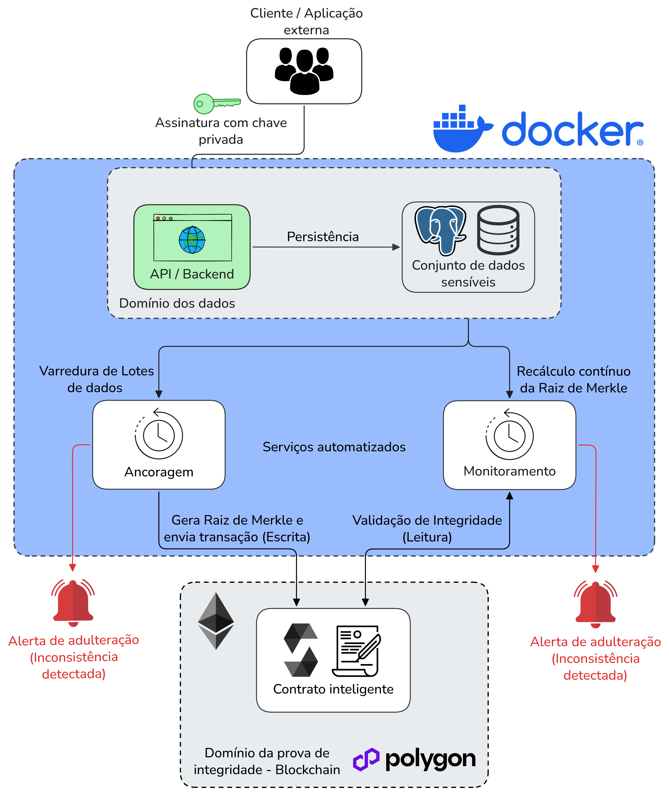

# Arquitetura do Sistema de Integridade de Dados e Ancoragem de Merkle (MADIS)

MADIS — Merkle-Anchored Data Integrity System

A arquitetura proposta busca mitigar a vulnerabilidade de adulterações silenciosas de dados em SGBDs relacionais. A solução descentraliza o domínio de confiança ao utilizar uma blockchain pública como âncora imutável de provas criptográficas do estado dos dados via Árvores de Merkle.

O escopo da solução não reside na prevenção de acessos de baixo nível (como um DBA privilegiado ou um invasor com acesso root), mas sim na **garantia de detectabilidade**: caso qualquer alteração arbitrária ocorra diretamente no banco de dados, a fraude é exposta e comprovável criptograficamente.

---

## 1. Princípios Fundamentais e Modelo de Confiança

- **A Blockchain como Âncora da Verdade:** A âncora de confiança do sistema é a blockchain pública, nunca o banco de dados relacional.
- **Modelo Adversarial Estrito:** Se um atacante possui privilégios para adulterar registros na tabela `records`, ele também teria poder para adulterar colunas auxiliares ou hashes pré-calculados persistidos no banco. Por essa razão, o serviço de auditoria (**Monitor**) nunca confia em hashes derivados salvos no SGBD; ele sempre recalcula as folhas e a Árvore de Merkle a partir dos dados brutos e compara o resultado diretamente com a blockchain.
- **Objetivo de Segurança:** Detectar manipulação não autorizada de dados por um insider ou atacante com acesso direto ao banco (DBA malicioso), ancorando as Raízes de Merkle em uma rede pública imutável com carimbo temporal (_timestamping_).

---

## 2. Divisão de Domínios e Estrutura do Monorepo

O sistema é estruturado em um monorepo orientado a domínios de responsabilidade única:

```text
madis/
├── apps/
│   ├── data-domain/          # API REST para ingestão e persistência de dados (PostgreSQL)
│   ├── integrity-domain/     # Contratos Inteligentes Hardhat / Solidity (EVM)
│   ├── anchor-service/       # Daemon de Ancoragem periódica (Escrita na Blockchain + DB)
│   └── monitor-service/      # Daemon de Auditoria contínua (Leitura na Blockchain + DB)
├── packages/
│   ├── contracts-shared/     # ABIs compiladas, endereços e tipagens TypeScript do contrato
│   └── crypto-utils/         # Biblioteca única de hashing, canonicalização, ABI encoding e Merkle Tree
└── db/
    ├── schema.sql            # Schema DDL do PostgreSQL (4 tabelas)
    └── setup-users.sql       # Configuração de permissões RBAC no PostgreSQL
```

### Descrição dos Domínios:

1. **Domínio do Cliente:**
   - Ponto de interação do usuário final ou sistema de origem.
   - Responsável pela entrada dos dados de negócio e geração de assinaturas digitais locais via carteira criptográfica (chaves privadas sob custódia do cliente, compatíveis com EVM / ECDSA).
2. **Domínio de Dados ([`apps/data-domain`](../../apps/data-domain)):**
   - API de backend que centraliza as operações no SGBD relacional sob o modelo _append-only_.
   - Valida a autenticidade da assinatura digital e a permissão do endereço do cliente antes de persistir os dados.
3. **Serviços em Segundo Plano ([`apps/anchor-service`](../../apps/anchor-service) e [`apps/monitor-service`](../../apps/monitor-service)):**
   - Processos desacoplados que executam tarefas agendadas e autônomas:
     - **Anchor Service:** Coleta registros pendentes, valida assinaturas, gera a Árvore de Merkle e ancora a raiz na blockchain.
     - **Monitor Service:** Reconstrói periodicamente as árvores dos lotes já ancorados, consulta a blockchain e dispara alertas e _drill-down_ em caso de anomalia.
   - Detalhes adicionais de arquitetura dos jobs encontram-se em [`docs/overview/jobs/JOBS_ARCHITECTURE.md`](../overview/jobs/JOBS_ARCHITECTURE.md).
4. **Domínio de Prova de Integridade ([`apps/integrity-domain`](../../apps/integrity-domain)):**
   - Camada descentralizada em redes públicas EVM (Polygon / Ethereum).
   - Hospeda o contrato inteligente [`MerkleAnchorRegistry.sol`](../../apps/integrity-domain/contracts/MerkleAnchorRegistry.sol), responsável pelo registro imutável com carimbo temporal (_timestamping_) das raízes de Merkle.
5. **Bibliotecas Compartilhadas ([`packages/`](../../packages)):**
   - Garante **Fonte Única da Verdade (Single Source of Truth)** para algoritmos criptográficos ([`packages/crypto-utils`](../../packages/crypto-utils)) e artefatos de contrato ([`packages/contracts-shared`](../../packages/contracts-shared)), evitando discrepâncias de implementação entre a API, o Anchor e o Monitor.

---

## 3. Diagrama e Fluxos de Operação



O sistema opera por meio de dois fluxos principais e complementares:

### Fluxo 1: Ingestão e Ancoragem

1. O cliente assina os dados de negócio com sua chave privada (ECDSA) e submete o pacote à API ([`apps/data-domain`](../../apps/data-domain)).
2. A API valida criptograficamente a assinatura e a permissão do signatário, persistindo o registro na tabela `records`.
3. Periodicamente, o **Anchor Service** ([`apps/anchor-service`](../../apps/anchor-service)) varre registros ainda não ancorados, valida novamente cada assinatura, computa as folhas e constrói a Árvore de Merkle.
4. Caso haja inconsistência na assinatura de algum registro, o Anchor emite um alerta do tipo `signature_mismatch` na tabela `integrity_alerts` e exclui o registro do lote.
5. A Raiz de Merkle resultante é enviada ao contrato inteligente [`MerkleAnchorRegistry.sol`](../../apps/integrity-domain/contracts/MerkleAnchorRegistry.sol) via transação de escrita assinada pela carteira do Anchor.
6. Após confirmação do bloco na blockchain, o lote em `batches` tem seu status atualizado para `confirmed`, e as provas individuais (_Merkle Proofs_) de cada registro são salvas em `anchor_records`.

### Fluxo 2: Auditoria Contínua e Detecção de Fraudes

1. O **Monitor Service** ([`apps/monitor-service`](../../apps/monitor-service)) executa ciclicamente de forma independente ao Anchor.
2. Para cada lote já confirmado, o Monitor recupera os dados originais no banco relacional e recalcula as folhas e a Raiz de Merkle usando a mesma lógica criptográfica.
3. O Monitor realiza uma consulta de leitura sem custo de gas (`eth_call`) ao método `containsMerkleRoot` do contrato inteligente.
4. Se a raiz recalculada localmente **não existir** na blockchain, conclui-se que ao menos um registro do lote foi adulterado pós-ancoragem. O Monitor emite um alerta `root_divergence` e aciona o procedimento de **Drill-Down**.
5. No Drill-Down, o Monitor utiliza o `merkle_proof` individual de cada registro salvo em `anchor_records` para testar cada registro isoladamente contra a raiz legítima na blockchain, emitindo alertas do tipo `record_tampered` e identificando com exatidão o registro violado.

---

## 4. Modelagem de Dados e Controle Append-Only

A modelagem de dados combina o mecanismo _append-only_ com a separação entre o domínio de negócio e a infraestrutura criptográfica em 4 tabelas relacionais ([`db/schema.sql`](../../db/schema.sql)):

{ Uma nova imagem atualizada para o diagrama será feita }

### 4.1. Tabela `records` (Negócio e Autoria — Append-Only)

Armazena os registros sensíveis protegidos pelo sistema. Nenhuma linha é alterada ou removida via `UPDATE` ou `DELETE`. Atualizações e deleções lógicas geram novos registros.

- `id` (`BIGSERIAL PK`): Identificador único da linha.
- `entity_id` (`BIGINT NOT NULL`): Identificador estável da entidade de negócio. Agrupa todas as versões de uma mesma entidade (versão 1, 2, 3...) facilitando a recuperação da linhagem histórica via `WHERE entity_id = X`. Escopado por `record_type` (`UNIQUE(record_type, entity_id, version)`), não globalmente único.
- `record_type` (`VARCHAR(20) NOT NULL`): Discriminador do tipo de registro de negócio: `'prescription'` (prescrição eletrônica) ou `'emr_encounter'` (atendimento/prontuário eletrônico). Domínio escolhido: Prontuário Médico e Prescrições Eletrônicas (Saúde) — ver `docs/DOMINIOS_PROPOSTOS.md`.
- `payload` (`JSONB NOT NULL`): Dados de negócio brutos assinados pelo cliente — é exatamente o `data` usado por `hashPayloadData`/`computeLeafHash` (`packages/crypto-utils`). O Monitor sempre recalcula as folhas a partir desta coluna, nunca de um hash pré-computado, preservando o modelo de confiança da blockchain como âncora única. A tabela permanece agnóstica de domínio: o formato de `payload` varia por `record_type` e é validado na borda da API (`data-domain`), não pelo SGBD.
- `version` (`INTEGER NOT NULL DEFAULT 1`): Número sequencial da versão da entidade.
- `is_deleted` (`BOOLEAN NOT NULL DEFAULT FALSE`): Marcador de deleção lógica.
- `replaces` (`BIGINT NULL FK -> records.id`): Ponteiro autorreferencial para a versão anterior que está sendo substituída.
- `client_address` (`CHAR(42) NOT NULL`): Endereço Ethereum do signatário original.
- `signature` (`TEXT NOT NULL`): Assinatura digital ECDSA dos dados da aplicação.
- `created_at` (`TIMESTAMPTZ NOT NULL DEFAULT NOW()`): Carimbo temporal de criação.

### 4.2. Tabela `batches` (Ciclo de Vida da Ancoragem)

Registra cada ciclo de execução do serviço de ancoragem e o estado da transação na blockchain.

- `id` (`BIGSERIAL PK`): Identificador único do lote.
- `status` (`VARCHAR(20) NOT NULL`): Estado no ciclo de vida: `pending` $\to$ `submitted` $\to$ `confirmed` ou `failed`.
- `merkle_root` (`CHAR(66) NOT NULL`): Raiz de Merkle calculada para o lote (`0x` + 64 hexadecimais).
- `size` (`INTEGER NOT NULL`): Quantidade de registros que compõem o lote.
- `transaction_hash` (`CHAR(66) NULL`): Hash da transação emitida na rede blockchain.
- `block_number` (`BIGINT NULL`): Número do bloco de inclusão na rede descentralizada.
- `block_timestamp` (`TIMESTAMPTZ NULL`): Timestamp oficial do bloco minerado.
- `retry_count` (`INTEGER NOT NULL DEFAULT 0`): Contador de tentativas de reenvio em caso de falhas transitórias.
- `error_message` (`TEXT NULL`): Descrição do erro em caso de falha/reversão.
- `created_at` / `confirmed_at` (`TIMESTAMPTZ`): Timestamps de início e finalização do ciclo.

### 4.3. Tabela `anchor_records` (Ponte Registro–Lote e Provas Individuais)

Vincula de forma unívoca (`UNIQUE(record_id)`) cada registro ao lote que o ancorou.

- `id` (`BIGSERIAL PK`): Identificador único.
- `record_id` (`BIGINT NOT NULL FK -> records.id`): Registro ancorado.
- `batch_id` (`BIGINT NOT NULL FK -> batches.id`): Lote de ancoragem.
- `merkle_proof` (`JSONB NOT NULL`): Array ordenado de hashes irmãos (_sibling hashes_) necessários para validar a inclusão da folha na raiz. Graças ao uso do padrão OpenZeppelin (_Sorted Pairs_), a verificação dispensa índices posicionais (`leaf_index`).
- `anchored_at` (`TIMESTAMPTZ NOT NULL DEFAULT NOW()`): Timestamp de vinculação.

### 4.4. Tabela `integrity_alerts` (Log de Incidentes e Auditoria)

Log imutável para persistência de divergências e fraudes detectadas.

- `id` (`BIGSERIAL PK`): Identificador do alerta.
- `alert_type` (`VARCHAR(30) NOT NULL`): Tipo de incidente: `'signature_mismatch'` | `'root_divergence'` | `'record_tampered'`.
- `source` (`VARCHAR(20) NOT NULL`): Origem da detecção: `'anchor'` | `'monitor'`.
- `batch_id` (`BIGINT NULL FK -> batches.id`): Lote afetado (se aplicável).
- `record_id` (`BIGINT NULL FK -> records.id`): Registro adulterado identificado (no caso de _drill-down_).
- `expected_root` (`TEXT NULL`): Raiz legítima registrada na blockchain.
- `actual_root` (`TEXT NULL`): Raiz espúria recalculada localmente.
- `details` (`TEXT NULL`): Contexto técnico complementar da ocorrência.
- `detected_at` (`TIMESTAMPTZ NOT NULL DEFAULT NOW()`): Timestamp da detecção.

### 4.5. Modelo de Permissões no PostgreSQL ([`db/setup-users.sql`](../../db/setup-users.sql))

Para assegurar a propriedade _append-only_ na camada de infraestrutura, o banco opera com dois perfis de usuário:

- **`app_user` (Princípio do Menor Privilégio):** Utilizado em produção pela API, pelo Anchor e pelo Monitor. Possui apenas permissão de `SELECT` e `INSERT` na tabela `records`, garantindo que qualquer tentativa de `UPDATE` ou `DELETE` seja bloqueada pelo próprio SGBD.
- **`admin_user` (Cenário Adversarial):** Usuário com privilégios administrativos irrestritos, utilizado exclusivamente para fins de testes empíricos de adulteração (simulando um atacante ou DBA malicioso com acesso direto ao banco).

---

## 5. Especificação Criptográfica e Construção da Árvore

Toda a lógica de hashing e manipulação da Árvore de Merkle é centralizada na biblioteca compartilhada [`packages/crypto-utils`](../../packages/crypto-utils).

### 5.1. Canonicalização de Dados (RFC 8785)

Para garantir determinismo estrito na serialização JSON dos atributos de negócio antes do hashing, é empregado o padrão RFC 8785 (JSON Canonicalization Scheme), garantindo ordenação estável de chaves e formatação uniforme:

$$\text{dataHash} = \text{Keccak256}(\text{toUtf8Bytes}(\text{canonicalize}(\text{dados})))$$

### 5.2. Cálculo da Folha Merkle ($L_i$)

Para garantir resistência a ataques de colisão e interoperabilidade com Solidity e o padrão EVM ABI, a folha da árvore é calculada via `AbiCoder.defaultAbiCoder().encode(["string", "bytes32", "string"], [id, dataHash, signature])`:

$$L_i = \text{Keccak256}\Big(\text{abi.encode}\big([\text{"string"}, \text{"bytes32"}, \text{"string"}], [id_i, \text{dataHash}_i, \text{signature}_i]\big)\Big)$$

### 5.3. Árvore de Merkle com Pares Ordenados (_Sorted Pairs_)

A construção da árvore adota a especificação padrão do ecossistema OpenZeppelin (`@openzeppelin/merkle-tree` e `MerkleProof.sol`):

- Ao combinar dois nós filhos $A$ e $B$, os hashes são ordenados lexicograficamente antes da concatenação:
  $$H(A, B) = \text{Keccak256}\big(\min(A, B) \parallel \max(A, B)\big)$$
- **Vantagem:** A verificação de provas torna-se completamente independente da posição original da folha na árvore, dispensando metadados como `leaf_index`.

---

## 6. Serviços em Segundo Plano (Jobs)

### 6.1. Daemon de Ancoragem (`apps/anchor-service`)

Processo em lote executado periodicamente (ex: a cada 1 a 3 horas):

1. **Varredura:** Busca registros em `records` que ainda não possuem entrada associada em `anchor_records`.
2. **Validação Prévia:** Verifica se a assinatura digital corresponde ao signatário e aos dados. Se inválido, emite alerta `signature_mismatch` e descarta o registro do lote.
3. **Construção da Árvore:** Gera as folhas $L_i$, computa a Raiz de Merkle e extrai o `merkle_proof` de cada folha.
4. **Transação On-Chain:** Invoca `MerkleAnchorRegistry.addMerkleRoot(root, batchSize)` na rede descentralizada.
5. **Persistência do Lote:** Insere os registros do lote na tabela `batches` e persiste as provas individuais em `anchor_records`.

### 6.2. Monitor de Integridade (`apps/monitor-service`)

Processo de auditoria contínua executado em alta frequência (ex: a cada 5 a 15 minutos):

1. **Recuperação:** Seleciona lotes confirmados na tabela `batches`.
2. **Reconstrução Independente:** Recupera os registros brutos em `records` e reconstrói a Raiz de Merkle a partir dos dados do banco.
3. **Checagem de Integridade On-Chain:** Executa uma chamada `eth_call` de custo zero de gas ao método `containsMerkleRoot(reconstructedRoot)`.
4. **Tratamento de Inconsistência:** Se a raiz divergir da blockchain:
   - Emite um alerta `root_divergence` para o lote em `integrity_alerts`.
   - Executa o procedimento de **Drill-Down** individual.

---

## 7. Estratégia de Alertas e Procedimento de Drill-Down

Quando uma divergência é detectada no nível do lote, o Monitor não apenas sinaliza o lote como fraudado, mas identifica individualmente quais registros sofreram adulteração:

```text
[Lote Divergente Detectado]
         │
         ▼
[1. Emite Alerta: root_divergence (batch_id)]
         │
         ▼
[2. Executa Drill-Down registro a registro]
   Para cada record no lote:
     a. Recalcula a folha Li a partir dos dados atuais de records
     b. Recupera o merkle_proof salvo em anchor_records
     c. Valida: verifyMerkleProof(merkle_proof, blockchainRoot, Li)
     d. Se FALHAR ──> [Emite Alerta: record_tampered (batch_id, record_id)]
```

### Propriedade de Segurança Adversarial do Drill-Down:

Mesmo que o atacante tenha alterado o `merkle_proof` ou os dados do lote no banco de dados relacional, a raiz de referência utilizada no teste de verificação é sempre a raiz imutável obtida da **Blockchain**, tornando computacionalmente inviável para o atacante forjar uma prova falsa que valide dados adulterados.

---

## 8. Contrato Inteligente ([`MerkleAnchorRegistry.sol`](../../apps/integrity-domain/contracts/MerkleAnchorRegistry.sol))

O contrato inteligente atua como a âncora pública de integridade do sistema. Ele é desenvolvido em Solidity (^0.8.28) utilizando as bibliotecas de referência da OpenZeppelin (`Ownable`, `MerkleProof`).

### Métodos Principais:

- `addMerkleRoot(bytes32 _root, uint256 _batchSize) external onlyOwner returns (uint256)`: Registra uma nova Raiz de Merkle e emite o evento `RootAdded`. Garante unicidade e impede o registro de raízes nulas.
- `containsMerkleRoot(bytes32 _root) public view returns (bool)`: Verificação de existência $O(1)$ sem custo de gas.
- `getMerkleRootAt(uint256 _index) external view returns (bytes32)`: Consulta histórica por índice sequencial.
- `getLatestMerkleRoot() external view returns (bytes32)`: Retorna a última raiz registrada.
- `getRootCount() external view returns (uint256)`: Retorna a quantidade total de lotes ancorados.
- `getMerkleRootsPaged(uint256 _offset, uint256 _limit) external view returns (bytes32[] memory)`: Permite paginação eficiente do histórico de raízes para sincronização off-chain.
- `verifyMerkleProof(bytes32 _root, bytes32[] calldata _proof, bytes32 _leaf) external view returns (bool)`: Valida uma prova criptográfica diretamente contra uma raiz registrada no contrato.
