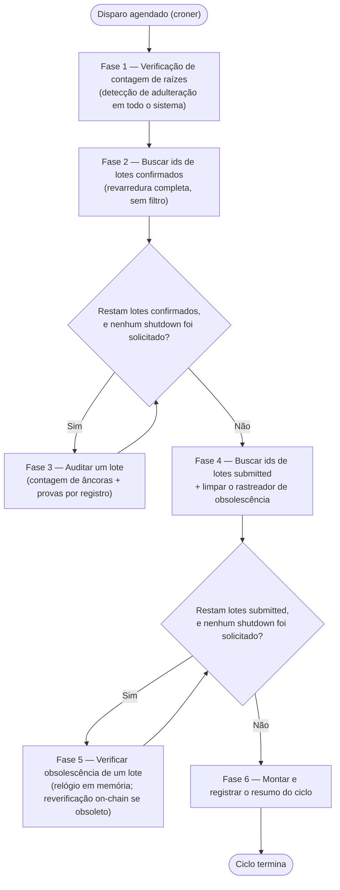

# `monitor-service` — Ciclo de Execução

O `monitor-service` ([`apps/monitor-service`](../../apps/monitor-service)) é o daemon de longa duração responsável pelo Fluxo 2 da arquitetura (ver [`ARCHITECTURE.md`](ARCHITECTURE.md) §3): periodicamente, ele re-deriva o estado de cada lote já ancorado diretamente das tabelas `records`/`anchor_records` e da própria blockchain, e dispara um alerta no momento em que qualquer uma das duas divergir do que foi de fato ancorado. Ele nunca assina nem envia uma transação na blockchain, e nunca escreve no Postgres além dos alertas que emite — toda outra ação deste daemon é uma leitura. O `anchor-service` é o único componente que possui uma carteira financiada e escreve na chain; o `monitor-service` existe exatamente para que essa garantia não precise ser confiada às cegas.

Este documento é mais granular que o resumo do §6.2 do `ARCHITECTURE.md` e reflete com precisão a implementação atual do daemon — leia este quando a pergunta for especificamente sobre como o `monitor-service` se comporta, fase por fase.

---

## 1. Ciclo de Vida do Daemon

O `monitor-service` não é um script executado uma única vez — é um processo Node.js de longa duração (`apps/monitor-service/src/index.ts`) com os mesmos três estágios de ciclo de vida que o `anchor-service` tem: verificações iniciais de sanidade, um laço agendado de ciclos de execução, e um encerramento gracioso (_graceful shutdown_).

### 1.1. Verificações Iniciais de Sanidade (_Fail-Fast_)

Antes de agendar qualquer coisa, o processo valida seu próprio ambiente e sua capacidade de se comunicar tanto com o Postgres quanto com a blockchain. Toda verificação é _fail-fast_: se qualquer uma delas falhar, o processo registra o erro e encerra imediatamente.

1. **Parsing da configuração** (`src/config.ts`) — toda variável de ambiente obrigatória (`DATABASE_URL`, `RPC_URL`, `ANCHOR_CHAIN_ID`) deve estar presente e bem formada. `CONTRACT_ADDRESS` é opcional e resolvido da mesma forma que o `anchor-service` resolve, a partir do registro de deployments por rede já commitado em `packages/contracts-shared`.
2. **Rejeição de chave privada.** Se `ANCHOR_PRIVATE_KEY` estiver presente no ambiente, mesmo que seja, `loadConfig` lança um erro imediatamente — exatamente o oposto da própria verificação inicial do `anchor-service`. Uma chave de assinatura em um auditor somente-leitura seria um defeito real de segurança, não uma variável inofensiva e não utilizada, então isso é capturado ruidosamente antes de qualquer outra coisa rodar.
3. **Conectividade com o banco** — um `SELECT 1` contra o pool do Postgres configurado.
4. **Identidade da rede** — o `chainId` do endpoint RPC conectado precisa corresponder ao `ANCHOR_CHAIN_ID` configurado.
5. **Deployment do contrato** — o endereço de contrato resolvido precisa de fato possuir bytecode naquela rede.

Não há verificação de propriedade (_ownership_) de carteira, porque não existe carteira alguma: `createReadOnlyChainClient` (`src/chain.ts`) nunca constrói uma `Wallet` do ethers — o próprio `JsonRpcProvider` é o `ContractRunner` do contrato, então toda chamada que este daemon faz é uma função `view`.

Se qualquer uma das etapas 3-5 lançar um erro, tanto o pool do banco quanto o provider da chain são fechados antes do processo encerrar. Se todas forem bem-sucedidas, o pool e o provider permanecem abertos durante todo o ciclo de vida do agendador.

### 1.2. Cliente da Chain e Política de Retry

Toda leitura on-chain que este daemon faz — `getBatchInfo` (Fases 3 e 5) e `getRootCount` (Fase 1) — passa pelo mesmo wrapper de retry, `createRetryingContract` (`src/chain.ts`), construído uma única vez na inicialização em torno da instância somente-leitura do contrato, e reutilizado durante todo o ciclo de vida do processo.

Uma reversão (_revert_) genuína do contrato é determinística: tentar `RootDoesNotExist` uma segunda vez falharia de forma idêntica, então qualquer erro que `decodeRevertName` (`packages/contracts-shared`) consiga decodificar como uma reversão nomeada aborta imediatamente, sem novas tentativas. Todo o resto — timeouts, conexões resetadas, _rate limiting_ — é uma condição transitória de rede e é reexecutado via [`p-retry`](https://github.com/sindresorhus/p-retry), até `MONITOR_RPC_RETRIES` tentativas (padrão: 4). Diferente da política de retry equivalente do `anchor-service`, aqui não existe nenhum escalonamento de taxa (_fee-bumping_) — são leituras gratuitas, não transações pagas, então não há nada a escalonar.

### 1.3. Agendamento

Uma vez que a inicialização é bem-sucedida, `createCycleScheduler` (`src/index.ts`) envolve todo o ciclo de execução (§2 abaixo) em um job do [`croner`](https://github.com/Hexagon/croner), configurado com a expressão cron em `MONITOR_CRON_SCHEDULE` (padrão: `*/5 * * * *`, a cada 5 minutos — deliberadamente muito mais frequente que o padrão de 3 horas do `anchor-service`, já que todo ciclo aqui é composto de leituras baratas e, geralmente, zero escritas, e rodar com frequência reduz diretamente por quanto tempo uma divergência genuína pode passar sem ser notada).

A proteção contra sobreposição usa a opção `protect` do croner, mas não como um simples `protect: true`: é passado `logSkippedOverlap(logger)` (`src/index.ts`), de modo que um disparo ignorado é explicitamente registrado como um aviso nomeando o horário de início do ciclo ainda em execução (`job.currentRun()`), em vez de ser simplesmente descartado. Esse callback só pode ser exercitado por um disparo *agendado* genuinamente sobreposto — um ciclo disparado manualmente (`.cron.trigger()`, o que todo outro teste deste código usa para disparar um ciclo sem esperar por um padrão cron real) nunca passa por `protect`, verificado diretamente contra o comportamento do próprio croner. No máximo um ciclo roda por vez, dentro de um único processo.

### 1.4. Encerramento Gracioso (_Graceful Shutdown_)

Ao receber `SIGTERM` ou `SIGINT`, `shutdownGracefully` (`packages/service-runtime` — exatamente a mesma função que o `anchor-service` usa) executa:

1. O job do croner é parado — nenhum novo ciclo começará a partir deste ponto.
2. Uma flag cooperativa de aborto é ativada.
3. Se houver um ciclo em andamento, a sequência de encerramento espera por ele terminar — mas apenas até `SHUTDOWN_GRACE_MS` (padrão: 30.000 ms / 30 segundos). Isso é deliberadamente muito mais curto que o padrão de 10 minutos do `anchor-service`: não há nenhuma transação na blockchain pendente para proteger aqui, apenas um punhado de leituras em andamento a qualquer momento.
4. Se o ciclo em andamento termina dentro do período de tolerância, o pool do banco é fechado e o provider da chain é destruído, e o processo encerra de forma limpa.
5. Se o período de tolerância se esgota primeiro, o processo encerra abruptamente (_hard-exit_) com um código de saída diferente de zero.

Diferente do checkpoint único e fixo de aborto do `anchor-service` (entre persistir um lote e submeti-lo), `runMonitorCycle` verifica a flag de aborto *antes de cada iteração de lote*, em ambos os seus laços por lote (o laço de auditoria de lotes confirmados da Fase 3, e o laço de lotes `submitted` obsoletos da Fase 5) — ver §2. Uma verificação em andamento para o lote atual sempre termina; apenas o *próximo* lote em qualquer um dos laços é ignorado. Isso é seguro em todo este daemon, porque toda unidade de trabalho que ele realiza é uma leitura mais, no máximo, a inserção de um alerta — nada jamais fica pela metade da forma como uma transação na blockchain em andamento ficaria.

---

## 2. O Ciclo de Execução

Cada disparo agendado executa exatamente um ciclo de execução, implementado por `runMonitorCycle` (`src/cycle.ts`). Diferente da sequência única e linear de fases do `anchor-service`, este ciclo executa três verificações em boa parte independentes, uma após a outra — uma verificação de contagem em nível de todo o sistema, uma revarredura completa por lote, e uma verificação de obsolescência por lote — agregando as três em um único resumo estruturado ao final.



As mesmas seis fases, em lista de texto simples:

```text
Fase 1  Verificação de contagem de raízes (total do contrato vs. lotes rastreados no Postgres)
Fase 2  Buscar todo id de lote confirmado (revarredura completa, sem filtro)
Fase 3  Auditar um lote confirmado (laço sobre os ids da Fase 2)
Fase 4  Buscar todo id de lote submitted + limpar o rastreador de obsolescência
Fase 5  Verificar a obsolescência de um lote submitted (laço sobre os ids da Fase 4)
Fase 6  Montar e registrar o resumo do ciclo
```

As Fases 1-2 e 4-5 nunca dependem do resultado uma da outra, e nenhuma das quatro verificações (a verificação de contagem da Fase 1, as duas verificações da Fase 3, a verificação de obsolescência da Fase 5) jamais interrompe o ciclo de continuar o resto — a falha de um único lote, ou até mesmo a falha da verificação de contagem de todo o sistema, apenas dispara um alerta e continua.

### Fase 1 — Verificação de Contagem de Raízes

**Responsabilidade:** detectar se um lote inteiro foi escondido da revarredura da Fase 2 — uma lacuna que a revarredura, por si só, não consegue ver, já que ela só consegue auditar lotes cujo `status` ainda diz `'confirmed'` no Postgres.

Implementada diretamente em `runMonitorCycle`, via `checkRootCount` (`src/root-count-check.ts`):

1. Duas leituras, em paralelo: o `getRootCount()` do contrato — o número total de raízes que ele já aceitou, uma por chamada bem-sucedida de `addMerkleRoot`, desde sempre, em todos os lotes — contra `countTrackedBatches` (`src/batch-selection-repository.ts`), um `COUNT(*)` de toda linha de `batches` atualmente `'confirmed'` ou `'submitted'`.
2. Se as duas divergirem, não há como saber, só a partir desta verificação, qual lote específico está faltando — esconder o status de um lote tanto de `'confirmed'` quanto de `'submitted'` o remove de toda outra verificação que este daemon executa. Isso dispara um alerta `root_divergence` com `batch_id` `null` — o único alerta que este daemon escreve sem um lote específico para culpar.
3. Independentemente do resultado, o ciclo sempre continua para a Fase 2 — esta verificação nunca bloqueia nem interrompe nada.

Lotes `'submitted'` são incluídos na contagem rastreada, não apenas os `'confirmed'`, por um motivo específico: se não fossem, esconder um lote real poderia ser compensado com uma linha `'submitted'` falsa e barata — invisível à revarredura da Fase 2 e, por si só, suficiente para fazer esta verificação passar. A Fase 5 existe especificamente para fechar essa lacuna remanescente.

### Fase 2 — Buscar IDs de Lotes Confirmados (Revarredura Completa)

**Responsabilidade:** decidir quais lotes a Fase 3 audita, sem deixar nada armazenado no Postgres controlar essa decisão.

Implementada por `findConfirmedBatchIds` (`src/batch-selection-repository.ts`): `SELECT id FROM batches WHERE status = 'confirmed' ORDER BY created_at ASC`. Deliberadamente sem filtro e sem limite — sem `LIMIT`, sem cursor, sem coluna de "última verificação", sem nenhum progresso armazenado. Todo lote confirmado é auditado em todo ciclo.

Essa é uma escolha ponderada, não a opção óbvia. Uma versão anterior dessa política considerou um timestamp `last_verified_at` por lote, auditando primeiro os lotes verificados há mais tempo — rejeitada porque esse timestamp viveria exatamente no banco de dados que todo este sistema assume que um atacante privilegiado pode escrever livremente. Um atacante que adultera um lote poderia simplesmente também atualizar seu próprio `last_verified_at` para "agora," empurrando-o para o fim da fila indefinidamente. A revarredura completa não tem esse tipo de estado para ser atacado. Ver `docs/overview/monitor-service/new_specs/2026-09-24-batch-selection-strategies.md` para a comparação completa contra essa alternativa rejeitada, e uma estratégia de amostragem aleatória documentada (não construída) para o caso de a escala deste sistema um dia superar o custo de uma revarredura completa.

### Fase 3 — Auditar Um Lote

**Responsabilidade:** para um lote já confirmado, verificar tanto que cada um de seus registros ainda está presente, quanto que nenhum de seus conteúdos foi editado desde a ancoragem.

Implementada por `auditBatch` (`src/audit.ts`), chamada uma vez para cada id de lote vindo da Fase 2:

1. **Verdade fundamental a partir da chain.** `getBatchInfo(batchId)` — nunca o próprio `batches.size`/`merkle_root` do Postgres — é a única fonte que esta fase confia sobre o que este lote realmente ancorou. Se isso reverter com `RootDoesNotExist` (uma linha `'confirmed'` no Postgres sem nenhum `BatchInfo` correspondente on-chain), a reversão se propaga para fora de `auditBatch` sem ser capturada; `runMonitorCycle` a captura no nível do laço, dispara um alerta `root_divergence` (`expected_root: null`, já que não há raiz para reportar) nomeando aquele id de lote, e segue adiante. Qualquer outra exceção (um formato genuinamente inesperado, uma conexão perdida no meio da stream) é registrada em log e o lote é ignorado sem um alerta — é uma anomalia, não evidência de adulteração, e a revarredura completa vai buscar esse mesmo lote de novo no próximo ciclo de qualquer forma.
2. **Verificação de contagem de âncoras.** `countAnchoredRecords` (`src/audit-repository.ts`) — um simples `COUNT(*)` das linhas atuais de `anchor_records` deste lote — é comparado contra o `size` on-chain via `checkAnchorCount` (`src/anchor-count.ts`). Qualquer divergência, não somente "menos que," dispara um alerta `root_divergence`. Essa é a única lacuna que um laço de provas por registro nunca consegue notar por conta própria, já que ele só visita linhas que ainda estão lá — uma linha de `anchor_records` deletada é invisível para ele.
3. **Verificação de prova por registro.** `streamAnchoredRecords` (`src/audit-repository.ts`) transmite (_stream_) toda linha de `anchor_records` ainda vinculada a este lote, unida (_join_) com as colunas brutas *atuais* daquele registro em `records`. `verifyAnchoredRecord` (`src/record-verification.ts`) recalcula cada folha a partir dessas colunas atuais — através do mesmo `computeLeafHash` com o qual o próprio contrato é compatível, nunca um hash pré-computado — e a verifica contra a prova capturada no momento da ancoragem, mais a raiz on-chain do lote. Todo registro cuja folha não verifica mais dispara um alerta `record_tampered` nomeando aquele `record_id` específico. `verifyAnchoredRecord` nunca lança uma exceção, mesmo com um `client_address`/`signature` malformado que, de outra forma, faria o próprio `computeLeafHash` lançar uma — uma linha que um agente privilegiado editou diretamente é reportada como um achado normal de adulteração, não um erro que abortaria a auditoria de todo o lote.

Os passos 2 e 3 rodam para todo lote, em todo ciclo, independentemente do resultado um do outro — uma linha deletada e uma linha editada podem coexistir no mesmo lote, e nenhuma verificação é pulada por causa da outra.

### Fase 4 — Buscar IDs de Lotes Submitted, Limpar o Rastreador de Obsolescência

**Responsabilidade:** decidir quais lotes `'submitted'` a Fase 5 reverifica individualmente neste ciclo, e parar de rastrear qualquer lote que não esteja mais nesse estado.

Implementada por `findSubmittedBatchIds` (`src/batch-selection-repository.ts`) — o mesmo formato de revarredura completa e sem filtro da Fase 2, mas contra `status = 'submitted'` — seguida imediatamente por `pruneSubmittedTracking` (apoiada pelo `pruneExcept` do `createStaleSubmittedTracker`, `src/stale-submitted-tracker.ts`), que descarta o rastreamento de qualquer id de lote que este processo observava anteriormente e que não está mais na lista de `submitted` deste ciclo.

### Fase 5 — Verificar a Obsolescência de Um Lote Submitted

**Responsabilidade:** eventualmente capturar uma linha `'submitted'` falsa — o único vetor de preenchimento que a verificação de contagem da Fase 1 não consegue, por si só, distinguir de um lote real ainda legitimamente confirmando — sem disparar alarmes em todo lote genuinamente em andamento que simplesmente ainda não foi minerado.

Implementada diretamente em `runMonitorCycle`, apoiada por `createStaleSubmittedTracker` (`src/stale-submitted-tracker.ts`):

1. `observeSubmittedBatch(batchId)` registra a primeira vez que este *processo* viu este id de lote como `'submitted'` (`Date.now()` — o relógio do próprio processo, nunca algo lido do Postgres) e retorna se ele foi rastreado continuamente, sem resolução, por pelo menos `MONITOR_SUBMITTED_STALE_MS` (padrão: 24 horas). Se ainda não estiver obsoleto, nada mais acontece para este lote neste ciclo — o estado ordinário para quase todo lote `submitted`, que normalmente confirma em minutos.
2. Uma vez que um id de lote *está* obsoleto, `getBatchInfo(batchId)` é chamado de fato. Se agora tiver sucesso, o lote chegou on-chain e a coluna `status` do Postgres simplesmente ainda não se atualizou — isso é trabalho do próprio laço de reconciliação do `anchor-service`, não deste daemon — e nada mais acontece. Se reverter com `RootDoesNotExist`, esse é o sinal: um lote que afirma estar a caminho de ser ancorado por muito mais tempo do que qualquer ciclo honesto de confirmação ou reenvio deveria levar, e que ainda não existe on-chain de forma alguma. Isso dispara um alerta `root_divergence` (`expected_root: null`) nomeando aquele id de lote.

**Por que 24 horas, e por que não pode ser menor:** o próprio laço de reconciliação do `anchor-service` roda apenas uma vez por disparo do `ANCHOR_CRON_SCHEDULE` (padrão de 3 em 3 horas), e um reenvio também não espera por sua própria confirmação — ele é disparado e retorna, então confirmar uma transação reenviada precisa de outro intervalo de cron completo por cima. Sem nada além dos padrões do próprio `anchor-service`, um lote `submitted` perfeitamente saudável pode legitimamente levar mais de 6 horas para se resolver. Uma versão anterior deste limite (30 minutos, dimensionado apenas contra uma única espera de confirmação) teria disparado falsos alarmes constantemente sobre esse atraso inteiramente normal. Ver [`docs/superpowers/specs/2026-09-24-monitor-service-daemon-design.md`](../superpowers/specs/2026-09-24-monitor-service-daemon-design.md) §3.1 para o raciocínio completo.

**Por que precisa ser o relógio deste processo, e não `batches.created_at`:** essa coluna é um valor comum, gravável por um atacante, sob o próprio modelo de ameaça deste sistema — um atacante poderia manter o `created_at` de uma linha falsa fixado em "agora" a cada ciclo, suprimindo essa verificação específica para sempre. Rastrear "por quanto tempo eu, pessoalmente, observei este lote" em memória, nunca persistido em lugar algum, fecha essa brecha especificamente. A única contrapartida honesta: um reinício do `monitor-service` limpa o rastreador, dando a todo lote atualmente `submitted` um novo período de tolerância. Isso é um atraso limitado e único, não uma lacuna permanente — explorá-lo exigiria a capacidade de reiniciar o próprio `monitor-service` mais rápido que o limite, repetidamente, o que exige controle de processo na máquina de monitoramento, fora do modelo de ameaça deste sistema (apenas acesso de escrita ao banco de dados).

### Fase 6 — Resumo do Ciclo

**Responsabilidade:** montar um único registro estruturado de tudo o que o ciclo fez.

Implementada diretamente no final de `runMonitorCycle`, registrada via `logger.info(summary, "monitor cycle complete")`. Todo ciclo emite exatamente um `MonitorCycleSummary`, contendo:

- o número do ciclo, uma discriminação de tempo por estágio (`stageMs`: `rootCountCheck`, `findConfirmedBatchIds`, `confirmedAudit`, `findSubmittedBatchIds`, `submittedStaleCheck`) e o `durationMs` total, para que um ciclo lento possa ser diagnosticado pelo estágio específico que consumiu o tempo;
- `rootCountMatches` — se a Fase 1 encontrou as duas contagens iguais;
- `batchesChecked` / `batchesComplete` e `recordsChecked` / `tamperedCount` vindos da Fase 3;
- `submittedBatchesStaleChecked` — quantos lotes `submitted` de fato cruzaram o limite de obsolescência e foram reverificados individualmente neste ciclo, não quantos são meramente `'submitted'` — na maioria dos ciclos, isso é zero;
- `alertsFired` — o número total de alertas escritos neste ciclo, somando as três verificações;
- `peakRssBytes` — uma amostra de pico de memória tirada uma vez por lote auditado, para capturar crescimento de memória de uma revarredura muito grande antes que se torne um problema operacional.

---

## 3. Garantias de Detecção (Resumo)

As quatro verificações acima (a verificação de contagem da Fase 1; a verificação de contagem de âncoras e o laço de provas por registro da Fase 3; a verificação de obsolescência da Fase 5) fecham, cada uma, uma lacuna que as outras não conseguem ver por conta própria — nenhuma é redundante com nenhuma outra:

- **O laço de provas por registro da Fase 3** captura uma linha *editada* — um registro ainda presente, ainda vinculado ao seu lote, cujo conteúdo não corresponde mais ao que foi ancorado.
- **A verificação de contagem de âncoras da Fase 3** captura uma linha *deletada* — um registro cujo vínculo em `anchor_records` desapareceu inteiramente, invisível a um laço de provas que só consegue visitar linhas que ainda estão lá.
- **A verificação de contagem de raízes da Fase 1** captura um *lote escondido* — um lote inteiro alterado para longe de `'confirmed'` e de `'submitted'`, invisível à revarredura da Fase 2, que só consegue auditar lotes cujo status ainda diz `'confirmed'`.
- **A verificação de obsolescência da Fase 5** captura um *lote de preenchimento forjado* — uma linha `'submitted'` falsa inserida especificamente para manter a contagem da Fase 1 equilibrada depois de esconder uma real, o que a Fase 1 sozinha não consegue distinguir de um lote real ainda legitimamente confirmando.

Juntas, não há como adulterar uma linha de `records`, deletar um vínculo de `anchor_records`, ou esconder/forjar uma linha de `batches` que sobreviva sem ser detectada por mais de um ciclo (Fases 1-3) ou por mais de `MONITOR_SUBMITTED_STALE_MS` (Fase 5). Ver [`docs/superpowers/specs/2026-09-24-monitor-service-daemon-design.md`](../superpowers/specs/2026-09-24-monitor-service-daemon-design.md) §3.1 para o argumento de por que isso é completo sem precisar enumerar toda raiz que o contrato já aceitou.

Todo alerta que este daemon escreve é deduplicado antes da inserção. `recordRootDivergence` / `recordTampered` (`src/alerts.ts`) verificam, cada um, a existência de uma linha do mesmo `alert_type`, indexada por `batch_id` (usando o `IS NOT DISTINCT FROM`, seguro contra nulos, do Postgres, já que o alerta da verificação de contagem de todo o sistema tem `batch_id` `null`) ou `record_id`, antes de escrever uma nova. Um lote ou registro que continua falhando na mesma verificação, ciclo após ciclo, produz exatamente um alerta, não um por ciclo — a mesma convenção que os próprios alertas `signature_mismatch` do `anchor-service` já usam.

---

## 4. Taxonomia de Alertas

| `alert_type` | Disparado por | `batch_id` | `record_id` | `expected_root` | Significado |
|---|---|---|---|---|---|
| `root_divergence` | Fase 1 | `null` | `null` | `null` | A contagem total de raízes do contrato divergiu de quantos lotes o Postgres rastreia como on-chain-ou-em-andamento. Nenhum lote específico para culpar. |
| `root_divergence` | Fase 3 (passo 1) | real | `null` | `null` | Um lote `'confirmed'` não possui nenhum `BatchInfo` on-chain — seu status foi adulterado, ou ele nunca foi de fato confirmado. |
| `root_divergence` | Fase 3 (passo 2) | real | `null` | raiz on-chain | A contagem de `anchor_records` de um lote não corresponde mais ao seu tamanho on-chain — um registro vinculado foi deletado (ou, anomalamente, um extra apareceu). |
| `root_divergence` | Fase 5 | real | `null` | `null` | Um lote `'submitted'` não possui `BatchInfo` on-chain por mais tempo do que qualquer ciclo honesto de confirmação/reenvio deveria levar — provavelmente forjado ou permanentemente travado. |
| `record_tampered` | Fase 3 (passo 3) | real | real | raiz on-chain | A folha recalculada de um registro específico não verifica mais contra sua prova armazenada e a raiz on-chain do lote — seus dados foram editados após a ancoragem. |

Toda linha aqui é escrita com `source = 'monitor'`, distinguindo-a dos próprios alertas `signature_mismatch` do `anchor-service` (`source = 'anchor'`) na mesma tabela `integrity_alerts`.
